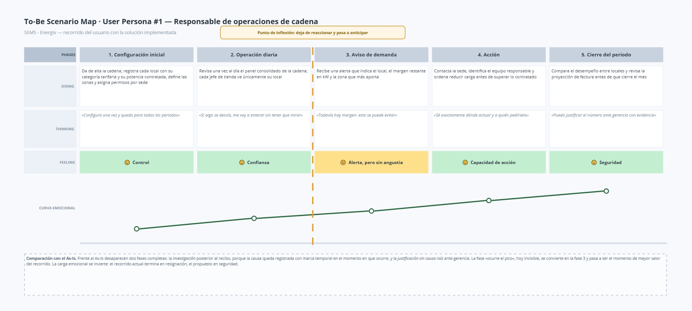
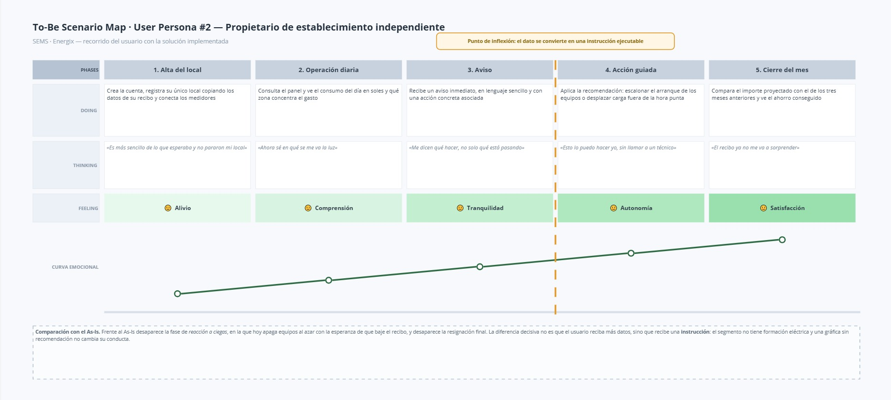
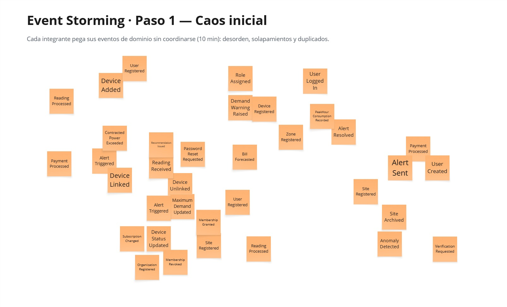
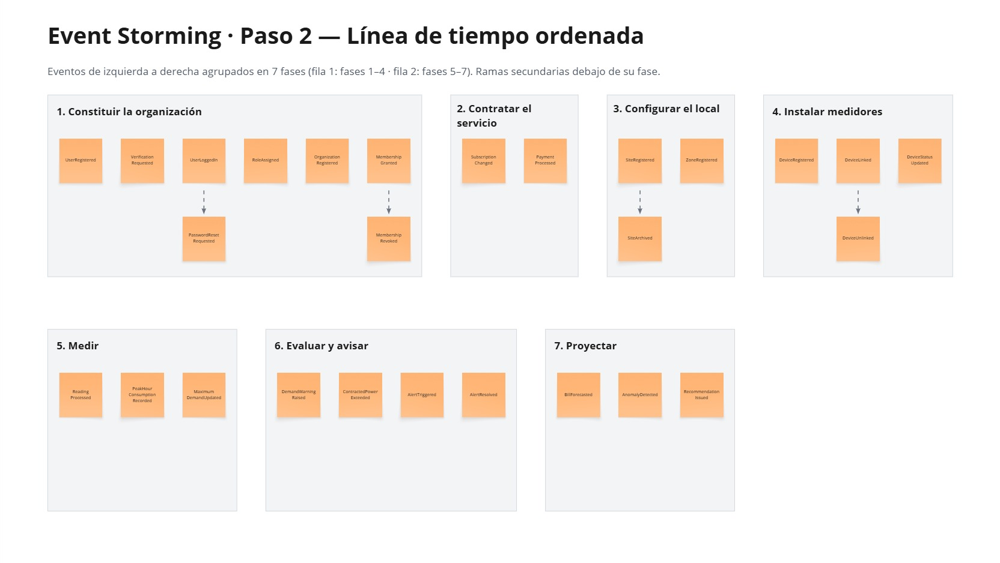
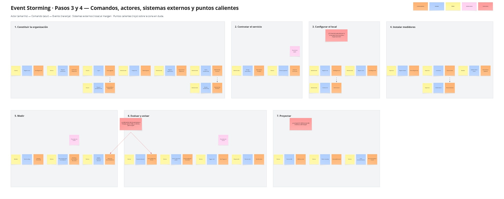
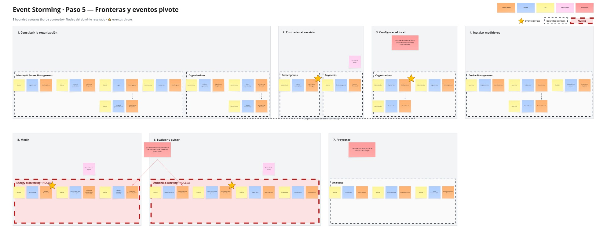
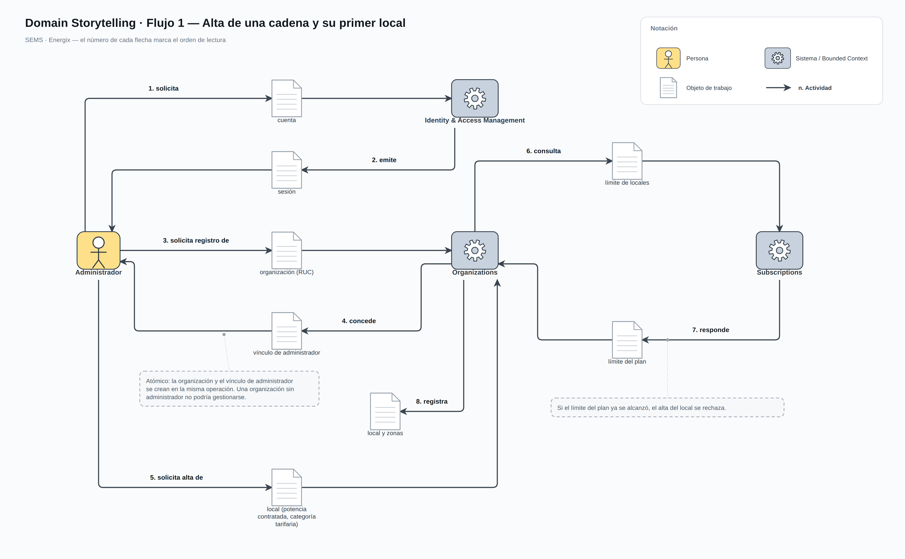
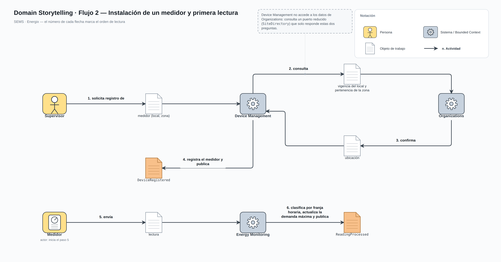
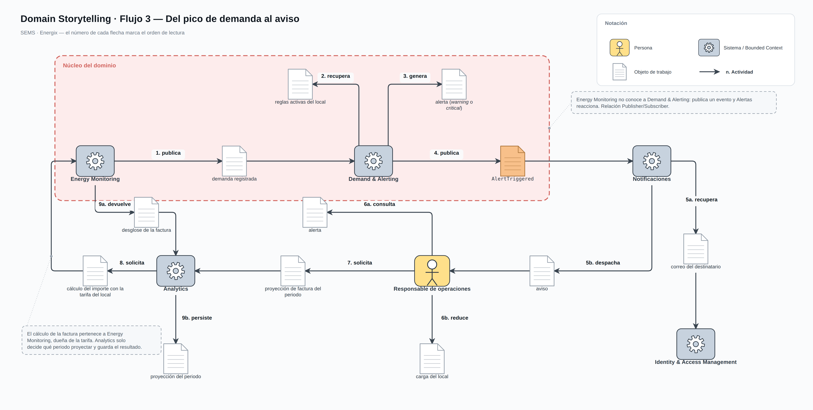

# UNIVERSIDAD PERUANA DE CIENCIAS APLICADAS

    </img>

**FACULTAD DE INGENIERÍA**

**Carrera:** Ingeniería de Software

**Curso:** 1ASI0728 - Arquitecturas de Software Emergentes

**Docente:** Enrique Alejandro Valdivia Verde

**NRC:** 16365

**Informe de Trabajo Final**

**Startup:** Energix

**Producto:** SEMS - Smart Energy Management System

### Integrantes

| Nombre completo | Código | Rol |
| :-- | :-- | :-- |
| Encalada Salazar, Alexis | U20211G491 | **Team Leader** |
| Goñe, Abigail | U202318049 | Integrante |
| Gómez Flores, Daniela Araceli | U202311184 | Integrante |
| Solis Santa Cruz, Giancarlo | U202318615 | Integrante |
| Sulca Silva, Melisa Geraldine | U202224602 | Integrante |

**Septiembre 2026**

**Ciclo Académico:** 202620

---

## Registro de Versiones del Informe

| Versión | Fecha | Autor | Descripción de modificación |
| :-- | :-- | :-- | :-- |

---

## Project Report Collaboration Insights

**Repositorio del informe:** <https://github.com/SEMS-Emergentes/SEMS-Report>

---

## Contenido

- [Student Outcome](chapters/00-student-outcome.md)
- [Capítulo I: Introducción](chapters/01-introduccion.md)
  - [1.1. Startup Profile](chapters/01-introduccion.md#11-startup-profile)
    - [1.1.1. Descripción de la Startup](chapters/01-introduccion.md#111-descripción-de-la-startup)
    - [1.1.2. Perfiles de integrantes del equipo](chapters/01-introduccion.md#112-perfiles-de-integrantes-del-equipo)
  - [1.2. Solution Profile](chapters/01-introduccion.md#12-solution-profile)
    - [1.2.1. Antecedentes y problemática](chapters/01-introduccion.md#121-antecedentes-y-problemática)
    - [1.2.2. Lean UX Process](chapters/01-introduccion.md#122-lean-ux-process)
      - [1.2.2.1. Lean UX Problem Statements](chapters/01-introduccion.md#1221-lean-ux-problem-statements)
      - [1.2.2.2. Lean UX Assumptions](chapters/01-introduccion.md#1222-lean-ux-assumptions)
      - [1.2.2.3. Lean UX Hypothesis Statements](chapters/01-introduccion.md#1223-lean-ux-hypothesis-statements)
      - [1.2.2.4. Lean UX Canvas](chapters/01-introduccion.md#1224-lean-ux-canvas)
  - [1.3. Segmentos objetivo](chapters/01-introduccion.md#13-segmentos-objetivo)
- [Capítulo II: Requirements Elicitation & Analysis](chapters/02-requirements-elicitation.md)
  - [2.1. Competidores](chapters/02-requirements-elicitation.md#21-competidores)
    - [2.1.1. Análisis competitivo](chapters/02-requirements-elicitation.md#211-análisis-competitivo)
    - [2.1.2. Estrategias y tácticas frente a competidores](chapters/02-requirements-elicitation.md#212-estrategias-y-tácticas-frente-a-competidores)
  - [2.2. Entrevistas](chapters/02-requirements-elicitation.md#22-entrevistas)
    - [2.2.1. Diseño de entrevistas](chapters/02-requirements-elicitation.md#221-diseño-de-entrevistas)
    - [2.2.2. Registro de entrevistas](chapters/02-requirements-elicitation.md#222-registro-de-entrevistas)
    - [2.2.3. Análisis de entrevistas](chapters/02-requirements-elicitation.md#223-análisis-de-entrevistas)
  - [2.3. Needfinding](chapters/02-requirements-elicitation.md#23-needfinding)
    - [2.3.1. User Personas](chapters/02-requirements-elicitation.md#231-user-personas)
    - [2.3.2. User Task Matrix](chapters/02-requirements-elicitation.md#232-user-task-matrix)
    - [2.3.3. Empathy Mapping](chapters/02-requirements-elicitation.md#233-empathy-mapping)
    - [2.3.4. As-is Scenario Mapping](chapters/02-requirements-elicitation.md#234-as-is-scenario-mapping)
  - [2.4. Ubiquitous Language](chapters/02-requirements-elicitation.md#24-ubiquitous-language)
- [Capítulo III: Requirements Specification](chapters/03-requirements-specification.md)
  - [3.1. To-Be Scenario Mapping](chapters/03-requirements-specification.md#31-to-be-scenario-mapping)
  - [3.2. User Stories](chapters/03-requirements-specification.md#32-user-stories)
  - [3.3. Impact Mapping](chapters/03-requirements-specification.md#33-impact-mapping)
  - [3.4. Product Backlog](chapters/03-requirements-specification.md#34-product-backlog)
- [Capítulo IV: Strategic-Level Software Design](chapters/04-strategic-design.md)
  - [4.1. Strategic-Level Attribute-Driven Design](chapters/04-strategic-design.md#41-strategic-level-attribute-driven-design)
    - [4.1.1. Design Purpose](chapters/04-strategic-design.md#411-design-purpose)
    - [4.1.2. Attribute-Driven Design Inputs](chapters/04-strategic-design.md#412-attribute-driven-design-inputs)
      - [4.1.2.1. Primary Functionality](chapters/04-strategic-design.md#4121-primary-functionality)
      - [4.1.2.2. Quality Attribute Scenarios](chapters/04-strategic-design.md#4122-quality-attribute-scenarios)
      - [4.1.2.3. Constraints](chapters/04-strategic-design.md#4123-constraints)
    - [4.1.3. Architectural Drivers Backlog](chapters/04-strategic-design.md#413-architectural-drivers-backlog)
    - [4.1.4. Architectural Design Decisions](chapters/04-strategic-design.md#414-architectural-design-decisions)
    - [4.1.5. Quality Attribute Scenario Refinements](chapters/04-strategic-design.md#415-quality-attribute-scenario-refinements)
  - [4.2. Strategic-Level Domain-Driven Design](chapters/04-strategic-design.md#42-strategic-level-domain-driven-design)
    - [4.2.1. EventStorming](chapters/04-strategic-design.md#421-eventstorming)
    - [4.2.2. Candidate Context Discovery](chapters/04-strategic-design.md#422-candidate-context-discovery)
    - [4.2.3. Domain Message Flows Modeling](chapters/04-strategic-design.md#423-domain-message-flows-modeling)
    - [4.2.4. Bounded Context Canvases](chapters/04-strategic-design.md#424-bounded-context-canvases)
    - [4.2.5. Context Mapping](chapters/04-strategic-design.md#425-context-mapping)
  - [4.3. Software Architecture](chapters/04-strategic-design.md#43-software-architecture)
    - [4.3.1. Software Architecture System Landscape Diagram](chapters/04-strategic-design.md#431-software-architecture-system-landscape-diagram)
    - [4.3.2. Software Architecture Context Level Diagrams](chapters/04-strategic-design.md#432-software-architecture-context-level-diagrams)
    - [4.3.3. Software Architecture Container Level Diagrams](chapters/04-strategic-design.md#433-software-architecture-container-level-diagrams)
    - [4.3.4. Software Architecture Deployment Diagrams](chapters/04-strategic-design.md#434-software-architecture-deployment-diagrams)
- [Conclusiones, Bibliografía y Anexos](chapters/99-conclusiones.md)

# Student Outcome

El curso 1ASI0728 contribuye al logro de la **Competencia ABET 3 — Trabajo Multidisciplinario**:
*capacidad de comunicarse efectivamente con un rango de audiencias*.

# Capítulo I: Introducción

## 1.1. Startup Profile

### 1.1.1. Descripción de la Startup

**Energix** es una startup formada por estudiantes de Ingeniería de Software de la Universidad
Peruana de Ciencias Aplicadas. Desarrollamos **SEMS (Smart Energy Management System)**, una
plataforma de gestión energética dirigida a **establecimientos comerciales de mediana y gran
superficie**: supermercados, tiendas por departamento, minimarkets, restaurantes y almacenes.

En este tipo de local la factura eléctrica no se explica solo por cuánta energía se consume.
Bajo las categorías tarifarias comerciales del pliego peruano, el recibo suma tres conceptos
distintos: la energía consumida en hora punta, la consumida fuera de punta y un **cargo por
potencia** calculado sobre la **demanda máxima** registrada en el mes. Ese tercer concepto es el
que suele pasar desapercibido y el que puede representar cerca de la mitad del costo variable
del recibo.

SEMS mide el consumo por local y por zona, calcula la factura estimada con la tarifa comercial
que corresponde a cada suministro, y avisa **antes** de que la demanda supere la potencia
contratada, cuando todavía se puede evitar el recargo.

**Misión**

Dar a los establecimientos comerciales visibilidad y control sobre su consumo y su demanda
eléctrica, para que reduzcan su costo energético con decisiones basadas en datos y no en
suposiciones.

**Visión**

Ser la plataforma de referencia en gestión energética para el retail y los servicios en el Perú,
capaz de acompañar tanto a un local independiente como a una cadena con decenas de sedes.

**Logo de la Startup**

`<Insertar imagen del logo de Energix>`

### 1.1.2. Perfiles de integrantes del equipo

| Integrante | Código | Carrera | Perfil |
| :-- | :-- | :-- | :-- |
| Encalada Salazar, Alexis **(Team Leader)** | U20211G491 | Ingeniería de Software | `<Foto. Párrafo de resumen con los principales conocimientos técnicos y habilidades que aporta al equipo.>` |
| Goñe, Abigail | U202318049 | Ingeniería de Software | `<Foto. Párrafo de resumen con los principales conocimientos técnicos y habilidades que aporta al equipo.>` |
| Gómez Flores, Daniela Araceli | U202311184 | Ingeniería de Software | `<Foto. Párrafo de resumen con los principales conocimientos técnicos y habilidades que aporta al equipo.>` |
| Solis Santa Cruz, Giancarlo | U202318615 | Ingeniería de Software |  Estudiante de Ingeniería de Software cursando el octavo ciclo. Persona proactiva, intuitiva y enfocada en la eficiencia, con un enfoque preventivo frente a los problemas. |
| Sulca Silva, Melisa Geraldine | U202224602 | Ingeniería de Software |     Estudio la carrera de Ingeniería de Software y me interesa el desarrollo web. Me motiva aprender nuevos lenguajes de programación. Suelo trabajar bien en equipo, muestro compromiso con el grupo y  aplico perseverancia para superar los obstáculos y alcanzar mis objetivos. |

## 1.2. Solution Profile

### 1.2.1. Antecedentes y problemática

El sector comercial y de servicios es uno de los mayores consumidores de electricidad del país,
y dentro de él los establecimientos con refrigeración continua —supermercados, minimarkets,
restaurantes— presentan la particularidad de operar cargas que no se apagan nunca. A esto se
suma que, a partir de cierto nivel de consumo, el suministro deja de facturarse bajo una tarifa
residencial de precio único y pasa a categorías comerciales (BT3, BT4, MT2, MT3) que introducen
dos conceptos ausentes en una vivienda: la **diferenciación por franja horaria** y el **cargo por
potencia sobre la demanda máxima**.

**Estructura tarifaria (fuente verificada).** El Anexo B de la Resolución de OSINERGMIN define
literalmente el horario de punta:

> *"Se entenderá por horas de punta (HP) el período comprendido entre las 18:00 horas y 23:00 horas
> de cada día de todos los meses del año, exceptuándose a solicitud del cliente, los días domingos,
> días de descanso que correspondan a feriados y feriados que coincidan con días de descanso."*
>
> — OSINERGMIN, *Anexo B: Opciones Tarifarias y Condiciones de Aplicación de las Tarifas*.
> Disponible en https://www.osinergmin.gob.pe/Resoluciones/pdf/ANEXO_B_Resolucion_1908.pdf

Dos consecuencias de esta definición condicionan el modelo de la solución. La primera es que la
hora punta rige **todos los días**, domingos incluidos: la exclusión de domingos y feriados existe,
pero es una opción que el cliente debe solicitar a la distribuidora, no una regla general. Para un
supermercado la diferencia es relevante, porque el domingo es uno de sus días de mayor afluencia.
La segunda es que la opción tarifaria MT2 —y sus equivalentes BT2, BT3 y BT4— es una tarifa con
medición doble de energía y contratación o medición de dos potencias, lo que significa que la
factura incorpora un cargo por potencia independiente de la energía consumida.

**Dimensión del segmento (fuente verificada).** El *Anuario Estadístico de Electricidad 2024* del
MINEM registra una venta de energía eléctrica a cliente final a nivel nacional de **53 288,7 GWh**,
repartida por sector económico de la siguiente manera:

| Sector económico | Energía vendida (GWh) | Participación |
| :-- | --: | --: |
| Industrial | 31 834,9 | 59,74 % |
| Residencial | 11 112,7 | 20,85 % |
| **Comercial** | **9 157,3** | **17,18 %** |
| Alumbrado público | 1 183,9 | 2,22 % |
| **Total** | **53 288,7** | **100,00 %** |

> MINEM, *Anuario Estadístico de Electricidad 2024*, Capítulo 5 «Distribución de energía eléctrica»,
> cuadro 5.3.3.1 «Venta mensual de energía eléctrica por sector económico (GWh)». Disponible en
> <https://www.gob.pe/institucion/minem/informes-publicaciones/7324144-anuario-estadistico-de-electricidad-2024>

El sector comercial es, por tanto, un mercado de **9 157 GWh anuales**: menor que el industrial en
volumen, pero con una diferencia estructural que resulta determinante para el producto. El consumo
industrial se concentra en un número reducido de clientes de gran tamaño, muchos de ellos del
mercado libre, que cuentan con personal e instrumentación propios para la gestión energética. El
consumo comercial, en cambio, se reparte entre miles de establecimientos —supermercados, tiendas
por departamento, farmacias, cadenas de conveniencia— que enfrentan la misma estructura tarifaria
con cargo por potencia y hora punta, pero sin un área de energía que la administre. Ese desajuste
entre la complejidad de la tarifa y la capacidad instalada del cliente es el espacio que ocupa SEMS.

El problema operativo es concreto. La demanda máxima que fija el cargo por potencia del mes se
determina por el **pico más alto registrado**, aunque ese pico haya durado quince minutos. En un
supermercado, el arranque simultáneo de los compresores de las cámaras frigoríficas tras un
corte, una jornada de alta afluencia o la puesta en marcha del aire acondicionado a primera hora
bastan para producirlo. El administrador del local no dispone de ninguna señal en el momento en
que ocurre: se entera treinta días después, cuando llega el recibo, y para entonces el recargo ya
está aplicado a todo el periodo.

A esa ceguera se añade una segunda: el recibo llega agregado por suministro. No indica qué zona
del local ni qué equipo originó el consumo, de modo que aunque el responsable quiera actuar, no
sabe **dónde** actuar. En una cadena con varias sedes el problema se multiplica, porque tampoco
existe forma sencilla de comparar el desempeño energético entre locales de tamaño y tipo
similares.

**Análisis de la problemática — 5W2H**

| Elemento | Descripción |
| :-- | :-- |
| **Who** (Quién) | Responsables de operaciones y de mantenimiento de cadenas de retail, y propietarios o administradores de establecimientos comerciales independientes de mediana superficie. Ambos responden por el costo energético del local pero carecen de información oportuna para gestionarlo. |
| **What** (Qué) | Sobrecosto eléctrico originado por dos causas que el recibo mensual no permite atacar: picos de demanda que disparan el cargo por potencia, y consumo concentrado en hora punta que podría desplazarse a franjas más baratas. A ello se suma la imposibilidad de atribuir el consumo a una zona o equipo concreto. |
| **Where** (Dónde) | Perú, en establecimientos comerciales urbanos con suministro en categorías tarifarias que incluyen cargo por potencia (BT3, BT4, MT2, MT3), principalmente en Lima Metropolitana y capitales de provincia. |
| **When** (Cuándo) | De forma continua durante la operación del local. El pico de demanda se produce típicamente en el arranque de la jornada y en las horas de mayor afluencia, que además coinciden con la hora punta del sistema (18:00–23:00 de todos los días, salvo que la distribuidora haya concedido la exclusión de domingos a solicitud del cliente). |
| **Why** (Por qué) | Porque la medición disponible es agregada y diferida: un único medidor por suministro y una única lectura mensual. No existe visibilidad por zona, ni distinción por franja horaria, ni ninguna alerta que llegue mientras el problema todavía se puede corregir. |
| **How** (Cómo) | Mediante medición por zona dentro de cada local, cálculo de la factura estimada con la tarifa comercial correspondiente al suministro, y alertas de demanda que se disparan al aproximarse a la potencia contratada, antes de superarla. |
| **How Much** (Cuánto) | El cargo por potencia puede representar cerca de la mitad del costo variable de un recibo comercial. Evitar un único pico mensual de exceso, o desplazar parte del consumo fuera de hora punta, produce ahorros directos y recurrentes. `<Sustentar con el cálculo del caso de estudio del equipo y con el pliego tarifario vigente.>` |

### 1.2.2. Lean UX Process

#### 1.2.2.1. Lean UX Problem Statements

**Domain**

Gestión del consumo y de la demanda eléctrica en establecimientos comerciales sujetos a
tarifas con cargo por potencia.

**Customer Segments**

Responsables de operaciones y mantenimiento de cadenas de retail, y propietarios o
administradores de establecimientos comerciales independientes.

**Pain Points**

- La factura eléctrica llega agregada y con un mes de retraso, cuando ya no se puede actuar.
- El cargo por potencia se fija por un pico puntual que nadie observa en el momento en que ocurre.
- No se puede atribuir el consumo a una zona concreta del local, así que no se sabe dónde intervenir.
- En una cadena no hay forma de comparar el desempeño entre locales para identificar cuáles están mal.
- Las soluciones existentes están diseñadas para el hogar y no modelan potencia contratada ni franjas horarias.

**Gap**

Existen medidores y plataformas de monitoreo energético, pero orientados al consumo doméstico:
reportan kilovatios-hora a un precio único. Ninguno de los que analizamos modela la estructura
tarifaria comercial peruana —hora punta, fuera de punta y demanda máxima— que es precisamente
donde se origina el sobrecosto del segmento.

**Vision / Strategy**

Convertir la factura eléctrica de un establecimiento en algo observable y accionable: medir por
zona, calcular con la tarifa real del suministro y avisar mientras todavía queda margen para
reaccionar.

**Initial Segment**

Establecimientos comerciales de Lima Metropolitana con superficie entre 200 y 2.000 m² y
suministro en categoría tarifaria con cargo por potencia.

**Enunciado del problema**

> Los establecimientos comerciales pagan un sobrecosto eléctrico que no pueden explicar ni
> anticipar, porque su única fuente de información es un recibo mensual agregado que llega
> cuando el cargo por potencia del periodo ya está determinado.
>
> Hemos observado que las plataformas de monitoreo energético disponibles fueron diseñadas para
> el consumo doméstico y reportan energía a precio único, lo que deja fuera los dos conceptos que
> más pesan en una factura comercial: la franja horaria y la demanda máxima.
>
> **¿Cómo podríamos** dar a los responsables de un establecimiento visibilidad por zona y avisos
> oportunos sobre su demanda, de modo que puedan evitar el recargo por potencia y desplazar
> consumo fuera de hora punta, sin exigirles conocimientos de ingeniería eléctrica?

#### 1.2.2.2. Lean UX Assumptions

**Business Assumptions**

1. Creemos que nuestros clientes necesitan visibilidad de su demanda eléctrica en el momento en que se produce, y no un mes después.
2. Estas necesidades se pueden resolver con una plataforma que mida por zona y calcule con la tarifa comercial del suministro.
3. Nuestros clientes iniciales son responsables de operaciones y propietarios de establecimientos comerciales con cargo por potencia.
4. El valor número uno que un cliente quiere de nuestro servicio es **evitar el recargo por exceso de demanda**.
5. El cliente también puede obtener beneficios adicionales como el desglose de consumo por zona y la comparación entre locales de la cadena.
6. Vamos a adquirir la mayoría de nuestros clientes mediante venta directa a cadenas y a través de gremios de comerciantes.
7. Generaremos ingresos mediante una suscripción mensual escalonada por número de locales gestionados.
8. Nuestra principal competencia en el mercado serán los proveedores de medidores inteligentes y las empresas de eficiencia energética que ofrecen auditorías puntuales.
9. Los venceremos porque entregamos monitoreo continuo y modelamos la tarifa comercial peruana, en lugar de un informe estático o un reporte de kWh.
10. Nuestro mayor riesgo es que la instalación del hardware de medición por zona resulte demasiado costosa o invasiva para el local.
11. Resolveremos esto permitiendo empezar con un solo medidor por local y añadir zonas de forma incremental.

**User Assumptions**

| Pregunta | Supuesto |
| :-- | :-- |
| ¿Quién es el usuario? | El responsable de operaciones o mantenimiento de una cadena, y el propietario o administrador de un local independiente. |
| ¿Dónde encaja nuestro producto en su trabajo o vida? | En la revisión operativa diaria del local y en el cierre mensual de costos. |
| ¿Qué problemas tiene nuestro producto que resolver? | La imposibilidad de anticipar el cargo por potencia y de atribuir el consumo a una zona. |
| ¿Cuándo y cómo es usado nuestro producto? | Consulta diaria breve desde el panel web, y reacción inmediata cuando llega una alerta de demanda. |
| ¿Qué características son importantes? | Alerta de demanda con margen, factura estimada desglosada, consumo por zona y comparación entre locales. |
| ¿Cómo debe verse y comportarse nuestro producto? | Directo y legible por personal no técnico: la alerta debe decir qué está pasando y cuánto margen queda, no mostrar una curva que haya que interpretar. |

#### 1.2.2.3. Lean UX Hypothesis Statements

**Hipótesis 1**

> **Creemos que** al notificar al responsable del local cuando la demanda alcanza el 85% de la
> potencia contratada
> **lograremos** que reduzca carga a tiempo y evite el recargo por exceso.
> **Sabremos que** hemos tenido éxito **cuando** al menos el 60% de las alertas de nivel *warning*
> vayan seguidas de un descenso de la demanda por debajo del umbral en los siguientes 30 minutos.

**Hipótesis 2**

> **Creemos que** al mostrar la factura estimada desglosada en energía, potencia y cargo fijo
> **lograremos** que el responsable identifique el peso real del cargo por potencia.
> **Sabremos que** hemos tenido éxito **cuando** más del 70% de los usuarios entrevistados sepa
> indicar, tras usar el panel, qué concepto pesa más en su recibo.

**Hipótesis 3**

> **Creemos que** al desglosar el consumo por zona dentro del local
> **lograremos** que las acciones de ahorro se dirijan a las zonas de mayor gasto.
> **Sabremos que** hemos tenido éxito **cuando** al menos el 50% de los locales con más de una
> zona registrada consulte la vista por zona al menos una vez por semana.

**Hipótesis 4**

> **Creemos que** al permitir comparar el consumo entre locales de una misma cadena
> **lograremos** que el responsable de operaciones detecte los locales con peor desempeño.
> **Sabremos que** hemos tenido éxito **cuando** las cuentas con tres o más locales usen la
> comparación al menos una vez al mes.

**Hipótesis 5**

> **Creemos que** al informar qué proporción del consumo cae en hora punta
> **lograremos** que el local desplace cargas desplazables a franjas más baratas.
> **Sabremos que** hemos tenido éxito **cuando** los locales que reciben la recomendación reduzcan
> su proporción de consumo en punta en al menos 5 puntos porcentuales en dos meses.

#### 1.2.2.4. Lean UX Canvas

`<Insertar imagen del Lean UX Canvas elaborado por el equipo, con los ocho cuadrantes:
1. Business Problem · 2. Business Outcomes · 3. Users · 4. User Outcomes & Benefits ·
5. Solutions · 6. Hypotheses · 7. What's the most important thing we need to learn first? ·
8. What's the least amount of work we need to do to learn the next most important thing?>`

| Cuadrante | Contenido |
| :-- | :-- |
| 1. Business Problem | Los establecimientos comerciales pagan un sobrecosto eléctrico que no pueden anticipar, porque el recibo mensual agregado llega cuando el cargo por potencia del periodo ya está fijado. |
| 2. Business Outcomes | Suscripciones activas de locales, tasa de renovación mensual, número de alertas de demanda atendidas a tiempo. |
| 3. Users | Responsable de operaciones o mantenimiento de cadena; propietario o administrador de local independiente. |
| 4. User Outcomes & Benefits | Evitar el recargo por exceso de demanda; saber en qué zona se va la energía; reducir el consumo en hora punta; comparar locales. |
| 5. Solutions | Medición por local y por zona; alerta de demanda con umbral configurable; factura estimada con tarifa comercial desglosada; comparación entre locales. |
| 6. Hypotheses | Las cinco hipótesis enunciadas en la sección 1.2.2.3. |
| 7. Lo más importante que necesitamos aprender primero | Si el aviso anticipado de demanda efectivamente provoca una acción de reducción de carga en el local, o si el responsable lo ignora por falta de margen operativo. |
| 8. Trabajo mínimo para aprenderlo | Instrumentar un local piloto con un único medidor, configurar la regla de demanda y registrar durante un mes qué ocurre tras cada alerta. |

## 1.3. Segmentos objetivo

Se han definido dos segmentos objetivo. Ambos responden por el costo energético de un
establecimiento comercial, pero se diferencian en la escala que gestionan, en el margen de
decisión que tienen y en el tipo de evidencia que necesitan para adoptar la solución.

### Segmento objetivo #1: Responsables de operaciones y mantenimiento de cadenas de retail

**Aspectos demográficos**

- Sexo: hombres y mujeres.
- Edad: entre 30 y 55 años.
- Formación: técnica o universitaria, con frecuencia en ingeniería industrial, electromecánica o administración.
- Cargo: jefe de operaciones, jefe de mantenimiento, coordinador de facilities o gerente de tienda regional.

**Aspectos geográficos**

- Nacionalidad: principalmente peruanos.
- Zona: urbana. Lima Metropolitana y capitales de provincia.
- Ámbito de responsabilidad: entre 2 y 40 locales.

**Aspectos psicográficos**

Responden ante una gerencia por indicadores de costo operativo y deben justificar cada inversión
con retorno demostrable. Valoran la evidencia por encima del argumento comercial: prefieren una
prueba en un local antes que una propuesta para toda la cadena. Están habituados a trabajar con
tableros e indicadores y toleran cierta complejidad si el dato es fiable.

**Aspectos conductuales**

Revisan indicadores de forma periódica, no continua. Reaccionan ante desviaciones, no ante
tendencias. Necesitan poder delegar la operación diaria en el personal de cada local, lo que
implica que la herramienta debe admitir varios usuarios con permisos distintos por sede.

### Segmento objetivo #2: Propietarios y administradores de establecimientos independientes

**Aspectos demográficos**

- Sexo: hombres y mujeres.
- Edad: entre 28 y 60 años.
- Formación: variable, frecuentemente sin especialización técnica en energía.
- Situación: propietario, socio o administrador de un único local de entre 200 y 800 m².

**Aspectos geográficos**

- Nacionalidad: principalmente peruanos.
- Zona: urbana, en distritos con actividad comercial densa.

**Aspectos psicográficos**

El recibo eléctrico es uno de sus costos fijos más altos y una fuente recurrente de
incertidumbre. No tienen formación eléctrica y desconfían de las propuestas que no puedan
verificar. Su criterio de adopción es el retorno inmediato y comprensible.

**Aspectos conductuales**

Descubren el problema cuando el recibo sube y no saben por qué. Tienen poca disponibilidad para
configurar herramientas y baja tolerancia a instalaciones invasivas que interrumpan la operación
del local. Necesitan que la herramienta les diga qué hacer, no que les entregue datos para que
ellos los interpreten.

# Capítulo II: Requirements Elicitation & Analysis

## 2.1. Competidores

El mercado de gestión energética para establecimientos comerciales en el Perú combina tres tipos
de oferta: fabricantes de medidores y hardware de monitoreo, empresas de servicios de eficiencia
energética que realizan auditorías puntuales, y plataformas internacionales de energy management
orientadas a grandes industrias. Ninguna de las tres resuelve por completo el problema de un
local comercial de mediana superficie.

**Schneider Electric (EcoStruxure Power)** es el referente global en gestión de energía. Ofrece
medición avanzada, análisis de calidad de energía y control de demanda, con integración a
sistemas de automatización de edificios. Su fortaleza es la profundidad técnica y la fiabilidad
del hardware. Su limitación para nuestro segmento es el costo y la complejidad: está diseñado
para plantas industriales y edificios corporativos, requiere integrador certificado y su modelo
comercial no se ajusta a un local de 500 m².

**Sistemas de gestión de las distribuidoras (Enel Perú, Luz del Sur)** ofrecen a sus clientes
comerciales portales de consulta de consumo y, en algunos casos, información de demanda máxima
facturada. Su fortaleza evidente es que la fuente del dato es la propia empresa que factura. Su
limitación es que el dato es diferido y agregado por suministro: sirve para consultar lo ocurrido,
no para actuar durante el mes, y no desglosa por zona ni por equipo.

**Empresas de eficiencia energética y auditoría (consultoras locales)** realizan diagnósticos
puntuales, miden durante un periodo acotado y entregan un informe con recomendaciones. Su
fortaleza es el criterio experto aplicado al caso concreto. Su limitación es que el resultado es
una fotografía: no hay seguimiento continuo, y meses después el local vuelve a no tener
visibilidad. Además el costo por intervención es elevado para un establecimiento independiente.

**Refoss / Shelly / medidores inteligentes de consumo** son dispositivos accesibles que permiten
ver el consumo en tiempo real desde una aplicación móvil. Su fortaleza es el precio y la
facilidad de instalación. Su limitación es determinante para este segmento: reportan energía a
un precio único por kWh, sin modelar franja horaria ni cargo por potencia, que es donde se
origina el sobrecosto comercial.

### 2.1.1. Análisis competitivo

| Competitive Analysis Landscape | | **Energix — SEMS** | **Schneider EcoStruxure** | **Portal de la distribuidora** | **Medidores tipo Refoss / Shelly** |
| :-- | :-- | :-- | :-- | :-- | :-- |
| **¿Por qué llevar a cabo este análisis?** | | Determinar qué necesidad del segmento de establecimientos comerciales no está siendo atendida por la oferta actual, y sobre qué base construir la ventaja competitiva de SEMS. | | | |
| **Perfil** | Overview | Plataforma web de gestión energética para establecimientos comerciales. Mide por local y por zona, calcula con la tarifa comercial peruana y avisa antes de superar la potencia contratada. | Suite empresarial de gestión de energía y automatización para industria y edificios corporativos. | Portal de consulta de consumo y facturación que la distribuidora ofrece a sus clientes. | Dispositivos de medición de consumo con aplicación móvil, orientados al mercado doméstico. |
| | Ventaja competitiva | Modela la estructura tarifaria comercial peruana completa (punta, fuera de punta y demanda máxima) y alerta con margen antes del exceso. | Profundidad técnica, calidad de energía, integración con control industrial y respaldo de marca global. | El dato proviene de la misma empresa que emite la factura. | Precio bajo e instalación sencilla. |
| **Perfil de Marketing** | Mercado objetivo | Establecimientos comerciales de 200 a 2.000 m² y cadenas de retail pequeñas y medianas. | Industria, minería, edificios corporativos y grandes superficies. | Todos los clientes de la concesionaria. | Consumidor doméstico y pequeño negocio. |
| | Estrategias de marketing | Venta directa a cadenas, alianzas con gremios de comerciantes y prueba piloto gratuita en un local. | Red de integradores certificados y venta consultiva de alto ticket. | Canal propio incluido en el servicio. | Comercio electrónico y retail de tecnología. |
| **Perfil de Producto** | Productos y servicios | Landing page, aplicación web, API RESTful y aplicación móvil. Alertas de demanda, factura estimada desglosada, consumo por zona y comparación entre locales. | Medidores, software de supervisión, servicios de ingeniería y analítica avanzada. | Consulta de recibos, histórico de consumo y demanda facturada. | Medidor con aplicación de consumo y automatizaciones básicas. |
| | Precios y costos | Suscripción mensual escalonada por número de locales. Plan de entrada gratuito para un local. | Licenciamiento e implementación de alto costo, con proyecto de integración. | Sin costo adicional, incluido en el servicio eléctrico. | Pago único por dispositivo. |
| | Canales de distribución | Web y móvil. | Integradores y fuerza de ventas directa. | Web y aplicación de la distribuidora. | Comercio electrónico. |
| **Análisis SWOT** | Fortalezas | Modela la tarifa comercial peruana; alerta preventiva de demanda; desglose por zona; equipo con conocimiento del contexto regulatorio local. | Marca consolidada, robustez técnica, catálogo completo de hardware y software. | Acceso directo al dato oficial de facturación. | Costo bajo, gran base instalada y facilidad de uso. |
| | Debilidades | Startup sin trayectoria ni base instalada; depende de hardware de medición de terceros; sin histórico de casos de éxito. | Costo y complejidad desproporcionados para el segmento; ciclo de venta largo. | Dato diferido y agregado; sin desglose por zona; sin capacidad de alerta preventiva. | No modela franja horaria ni demanda máxima; orientado al hogar; sin gestión multi-local. |
| | Oportunidades | Segmento desatendido entre el medidor doméstico y la suite industrial; presión creciente sobre los costos operativos del retail. | Expansión hacia edificios comerciales medianos. | Ampliar los servicios digitales al cliente comercial. | Adaptar su producto al segmento comercial. |
| | Amenazas | Que la distribuidora o un fabricante de medidores incorporen alertas de demanda en su propia oferta. | Competidores especializados más ágiles en nichos concretos. | Regulación y competencia en la comercialización eléctrica. | Saturación del mercado y competencia por precio. |

### 2.1.2. Estrategias y tácticas frente a competidores

**Frente a la debilidad de los medidores domésticos (no modelan la tarifa comercial)**

Nuestra estrategia es hacer de la tarifa el núcleo del producto y no un añadido. La táctica
concreta es mostrar en el panel la factura estimada **desglosada** en energía de punta, energía
fuera de punta y cargo por potencia, de modo que el usuario vea con sus propios números qué
proporción de su recibo depende del pico y no del consumo. Ese desglose es la demostración más
directa de por qué un medidor doméstico no le sirve.

**Frente a la fortaleza de las suites industriales (profundidad técnica y marca)**

No competimos en profundidad técnica. Nuestra estrategia es competir en **tiempo hasta el primer
valor**: mientras una implementación industrial requiere un proyecto de integración, SEMS permite
dar de alta una organización, un local y un medidor en minutos, y empezar a recibir alertas de
demanda el mismo día. La táctica es un plan de entrada gratuito para un local, pensado para que
el responsable pruebe sin autorización de compra.

**Frente a la ventaja del portal de la distribuidora (dato oficial)**

No disputamos la fuente del dato de facturación. Nuestra estrategia es posicionarnos en el
**momento** en que el dato es útil: el portal informa de lo ocurrido, SEMS avisa mientras todavía
se puede evitar. La táctica es explicitar en la comunicación que el cargo por potencia se fija por
un pico de minutos y que ninguna consulta mensual permite prevenirlo.

**Frente a la amenaza de que un competidor incorpore alertas de demanda**

Nuestra estrategia es construir el diferencial en la capa que es más difícil de copiar: el
modelado por **zona** y la comparación entre locales de una cadena, que requieren estructura de
dominio y no solo un umbral sobre una señal. La táctica es priorizar en el backlog las
funcionalidades multi-local desde los primeros sprints.

**Aprovechando nuestra oportunidad (segmento desatendido)**

La estrategia es concentrarnos en un nicho concreto y ganarlo antes de ampliar: establecimientos
con refrigeración continua, donde el problema del pico de demanda es más agudo y más fácil de
demostrar. La táctica es construir el caso de negocio con un local piloto y usar sus cifras
reales como argumento de venta ante cadenas del mismo rubro.

## 2.2. Entrevistas

### 2.2.1. Diseño de entrevistas

Las entrevistas buscan validar las hipótesis del *Lean UX Process* y recoger la información
necesaria para construir los arquetipos: características demográficas, contexto operativo del
local, comportamiento frente al recibo, canales digitales de interacción y disposición a adoptar
la solución.

Se realizarán entre **3 y 5 entrevistas por segmento**, registradas en video. Cada entrevista se
inicia explicando el propósito de la investigación y solicitando consentimiento para la grabación.

> **Nota metodológica.** Las preguntas están formuladas de manera abierta y evitan sugerir la
> respuesta. En particular, las preguntas sobre el cargo por potencia se plantean **sin nombrarlo**
> al inicio (preguntas 6 y 7 del segmento 1), para comprobar si el entrevistado lo identifica por
> sí mismo. Si se le explica primero, la respuesta pierde valor como evidencia.

#### Entrevista — Segmento #1: Responsables de operaciones y mantenimiento de cadenas de retail

**Bloque A. Perfil y contexto**

1. ¿Podría contarnos su cargo, cuánto tiempo lleva en él y cuántos locales están bajo su responsabilidad?
2. ¿Qué tipo de establecimientos son y qué superficie aproximada tienen?
3. ¿Quién decide en su organización una inversión en equipamiento o software para los locales, y qué necesita usted para sustentarla?

**Bloque B. Situación actual del costo energético**

4. ¿Qué lugar ocupa el costo eléctrico dentro de los costos operativos que usted gestiona?
5. ¿Cómo se entera hoy de cuánto consumió cada local y con qué frecuencia lo revisa?
6. Cuando el recibo de un local sube respecto del mes anterior, ¿cómo averigua a qué se debió?
7. ¿Qué conceptos aparecen en el recibo de sus locales? ¿Cuál de ellos le resulta más difícil de explicar o de controlar?
8. ¿Ha tenido alguna vez un recibo que le sorprendiera? ¿Qué hizo al respecto?

**Bloque C. Operación y equipos**

9. ¿Qué equipos considera que consumen más en sus locales y en qué momento del día?
10. ¿Existe algún procedimiento cuando se produce un corte y los equipos vuelven a arrancar todos a la vez?
11. ¿Puede identificar qué zona de un local (sala de ventas, cámaras, almacén, oficinas) consume más? ¿Cómo lo sabría?
12. ¿Tiene forma de comparar el desempeño energético entre locales similares de la cadena?

**Bloque D. Solución y adopción**

13. Si pudiera recibir un aviso mientras el consumo de un local se está disparando, ¿qué haría con ese aviso? ¿Quién debería recibirlo?
14. ¿Quién en cada local debería poder ver esta información y quién debería poder modificar la configuración?
15. ¿Qué tendría que demostrarle una herramienta de este tipo para que usted la lleve a su gerencia?
16. ¿Qué le haría desconfiar o abandonar una herramienta así?

**Bloque E. Perfil digital**

17. ¿Desde qué dispositivo revisaría esta información: computadora de oficina, teléfono, ambos?
18. ¿Qué herramientas digitales usa hoy para gestionar la operación de los locales?
19. ¿Cómo prefiere recibir una alerta urgente: correo, mensajería, notificación en la aplicación?

#### Entrevista — Segmento #2: Propietarios y administradores de establecimientos independientes

**Bloque A. Perfil y contexto**

1. ¿Podría contarnos qué tipo de negocio tiene, hace cuánto y qué superficie aproximada ocupa?
2. ¿Cuál es su rol en el día a día del local?
3. ¿Cuántas personas trabajan en el local y quién se ocupa de temas como el mantenimiento o los servicios?

**Bloque B. Situación actual del costo energético**

4. ¿Cuánto representa el recibo de luz dentro de sus gastos fijos mensuales?
5. ¿Cómo revisa su recibo? ¿Mira solo el total o entra en el detalle?
6. ¿Ha notado variaciones entre meses que no supiera explicar? ¿Qué hizo?
7. ¿Sabe qué potencia tiene contratada para su local? ¿Sabe qué pasa si la supera?
8. ¿Alguna vez le han ofrecido una revisión o auditoría eléctrica? ¿Qué resultado tuvo?

**Bloque C. Operación y equipos**

9. ¿Qué equipos de su local funcionan las 24 horas y cuáles solo durante la atención?
10. ¿En qué momento del día siente que el local consume más?
11. Si tuviera que reducir consumo mañana, ¿sabría por dónde empezar?

**Bloque D. Solución y adopción**

12. Si recibiera un aviso en el momento en que su local se acerca a un consumo que le va a costar caro, ¿qué haría?
13. ¿Qué información le gustaría ver para saber en qué parte del local se le está yendo la energía?
14. ¿Cuánto estaría dispuesto a pagar mensualmente por una herramienta que le ahorre una parte de su recibo? ¿Qué ahorro tendría que demostrarle para que valga la pena?
15. ¿Qué tan dispuesto estaría a que le instalen un equipo de medición en su tablero eléctrico? ¿Qué le preocuparía de eso?
16. ¿Qué le haría abandonar una herramienta así después de probarla?

**Bloque E. Perfil digital**

17. ¿Qué dispositivo usa habitualmente para temas del negocio?
18. ¿Usa alguna aplicación para llevar cuentas, inventario o ventas? ¿Cuál y por qué esa?
19. ¿Cómo prefiere que le llegue un aviso urgente del local?

### 2.2.2. Registro de entrevistas

> **Pendiente de ejecución por el equipo.** Esta sección se completa con las entrevistas reales.
> Por cada entrevista se debe registrar: nombres y apellidos, edad, distrito, cargo, un screenshot
> del cuadro de video, el URL del video subido a Microsoft Stream con el *timing* de inicio y la
> duración, y un resumen descriptivo de las principales respuestas.
>
> **El resumen debe incluir todas las características objetivas y subjetivas** (personalidad,
> marcas e influencias, tecnología, canales de interacción, navegador y dispositivos), porque cada
> característica de los arquetipos de la sección 2.3 debe poder rastrearse hasta un dato recogido
> aquí.

#### Segmento #1 — Entrevista 1

| Campo | Dato |
| :-- | :-- |
| Nombres y apellidos | Luis Paredes |
| Edad | 28 |
| Distrito | Lince |
| Cargo / tipo de establecimiento | Administrador de cadena de juguerías |
| Número de locales a cargo | 3 |
| URL del video | https://acortar.link/rd0LIG |
| Timing de inicio | 00:00 |
| Duración | 12:24 |
| Screenshot | |

**Resumen de la entrevista**

Luis tiene 28 años y administra tres juguerías en Miraflores, San Isidro y Surco, con locales de entre 50 y 60 m² cada uno. Lleva tres años con el primer local pero el segundo y tercero los abrió hace apenas ocho meses. La electricidad constituye su segundo gasto más importante después de la planilla y los equipos principales son licuadoras industriales, refrigeradoras de fruta, aire acondicionado split y vitrinas frías, todos concentrados en una cocina pequeña por local. Se entera del consumo únicamente cuando llega el recibo físico o cuando la encargada se lo menciona, sin ninguna visibilidad en tiempo real. Cuando el monto sube llama a la encargada y la respuesta habitual es "no sé, todo normal", quedándose sin poder identificar la causa. No entiende bien algunos conceptos del recibo como el cargo por energía reactiva o el cargo fijo mensual, y duda si está en la tarifa correcta para su tipo de negocio.

En el local de Surco estuvo dos meses pagando el doble de lo esperado porque el aire acondicionado heredado del local anterior estaba en mal estado y nadie lo detectó hasta que llegó el recibo. El pico de consumo ocurre entre las 7 y las 10 de la mañana cuando todos los equipos arrancan juntos al abrir, sin ningún protocolo escalonado, y hay un segundo pico al mediodía. El local de Miraflores siempre sale más caro que los otros dos pero no puede determinar si se debe al volumen de ventas, a equipos más viejos o al comportamiento de la encargada. Actualmente, él revisa los recibos mensuales, coordina mediante WhatsApp y registra los gastos en Excel, sin contar con información centralizada ni medición del consumo por equipo. Necesita ver los tres locales desde un solo lugar en su celular, que las alertas deben identificarle qué equipo o local específico está generando el problema porque si solo dicen "consumo alto" no sabe qué hacer. Los cambios de configuración deben manejarse solo desde él, no desde cada encargada, para evitar que cada una lo toque a su criterio. Para convencer a su socio necesita mostrar resultados reales en el recibo en máximo un mes, con números en soles, no proyecciones, y acompañados de un caso de negocio similar. Por ultimo, nos comenta que rechazaría una solución que genere alertas irrelevantes o requiera asistencia técnica frecuente, y prefiere WhatsApp para recibir avisos urgentes.

#### Segmento #1 — Entrevista 2

| Campo | Dato |
| :-- | :-- |
| Nombres y apellidos | Mariel |
| Edad | 25 |
| Distrito | Los Olivos |
| Cargo / tipo de establecimiento | Administradora de establecimientos |
| Número de locales a cargo | 6 |
| URL del video | [https://sl1nk.com/5tpz14d](https://sl1nk.com/5tpz14d) |
| Timing de inicio | 0:05 |
| Duración | 11:43 |
| Screenshot | |

**Resumen de la entrevista**

El principal dolor de Mariel es la falta de visibilidad y control oportuno sobre el consumo energético de los diferentes locales. Actualmente se entera del consumo mediante recibos y revisiones mensuales, cuando el gasto ya ocurrió. Cuando aparece un incremento, debe investigar manualmente con los encargados y revisar los equipos para intentar encontrar la causa. Esto es especialmente problemático cuando se producen picos de demanda, porque pueden ocurrir sin que nadie los detecte en el momento. Lo que **busca** es poder supervisar de manera más eficiente el desempeño energético de sus locales, identificar cuáles presentan problemas, conocer qué zonas o equipos generan mayor consumo y actuar antes de que una situación termine convirtiéndose en un sobrecosto. También necesita información que pueda utilizar para comparar locales y tomar decisiones de manera objetiva. Por ello, espera encontrar una solución que le proporcione información confiable y oportuna, con alertas que realmente requieran una acción, indicadores para comparar los locales y datos que le permitan demostrar resultados económicos ante la gerencia. No quiere simplemente otro dashboard con gráficos; necesita información que facilite la toma de decisiones y que pueda demostrar un ahorro real.

#### Segmento #1 — Entrevista 3

| Campo | Dato |
| :-- | :-- |
| Nombres y apellidos | Jeanfer Oshiro  |
| Edad | 26 años |
| Distrito | Lima  |
| Cargo / tipo de establecimiento | Supervisor de Operaciones y Mantenimiento entiendas de conveniencia |
| Número de locales a cargo | 14 locales|
| URL del video | [Entrevista 3](https://upcedupe-my.sharepoint.com/:v:/g/personal/u202318615_upc_edu_pe/IQBJfCru_2aPQrXWkaK2bFosASkNYu94g8P10R2t540gJU8?nav=eyJyZWZlcnJhbEluZm8iOnsicmVmZXJyYWxBcHAiOiJPbmVEcml2ZUZvckJ1c2luZXNzIiwicmVmZXJyYWxBcHBQbGF0Zm9ybSI6IldlYiIsInJlZmVycmFsTW9kZSI6InZpZXciLCJyZWZlcnJhbFZpZXciOiJNeUZpbGVzTGlua0NvcHkifX0&e=SaMynI) |
| Timing de inicio | 00:03 |
| Duración | 8:41 |
| Screenshot |  |

**Resumen de la entrevista**

Jeanfer supervisa 14 locales de conveniencia (120 a 160 m²) en Lima. En el plano objetivo, la energía eléctrica representa su segundo mayor costo operativo (25% a 30% del gasto mensual por tienda), donde los equipos de frío comercial consumen más del 50% del total. Identifica como momentos críticos el horario punta (6:00 p.m. a 11:00 p.m.) y los reencendidos descontrolados tras cortes de luz, situaciones que disparan la potencia leída y generan penalidades tarifarias. Actualmente opera de forma reactiva: analiza anomalías hasta 20 días después mediante facturas de Luz del Sur o Pluz Energía y hojas de cálculo en Excel, careciendo de medición por zonas. En el plano subjetivo, manifiesta frustración e impotencia al intentar justificar desvíos presupuestarios ante gerencia basándose únicamente en suposiciones. Para viabilizar una solución IoT ante Finanzas, exige un retorno de inversión menor a un año y una reducción mínima del 10% en potencia calculada con la regulación peruana. Asimismo, desconfía de sistemas que presenten desconexiones continuas de Wi-Fi o saturación por alertas falsas, priorizando notificaciones inmediatas por WhatsApp o push móvil para él y su técnico.

#### Segmento #2 — Entrevista 1

| Campo | Dato |
| :-- | :-- |
| Nombres y apellidos | Joaquin Cuentas |
| Edad | 29 |
| Distrito | San Miguel |
| Cargo / tipo de establecimiento | Dueño de lavandería |
| Número de locales a cargo | 1 |
| URL del video | https://acortar.link/YRmRAy |
| Timing de inicio | 00:00 |
| Duración | 10:32 |
| Screenshot |  |

**Resumen de la entrevista**

Joaquín tiene 29 años y es dueño de una lavandería de 90 m² en Lince que opera hace tres años. Trabaja con dos colaboradoras y participa en la atención, programación de lavados, entregas y administración de cuentas. El local concentra siete equipos de alto consumo: cuatro lavadoras industriales, tres secadoras industriales, dos planchas a vapor, un aire acondicionado split y un calentador de agua eléctrico. La luz representa entre el 20 y el 25% de sus costos fijos mensuales, pagando cerca de S/ 900 el mes pasado, cifra que considera excesiva para el tamaño del local. Revisa solo el total del recibo porque no entiende el detalle, no sabe qué significa el cargo por energía reactiva ni si está en la tarifa correcta. Cuando el monto varía no tiene forma de saber a qué equipo atribuírselo. Además, contó que una vez el recibo subió casi S/ 200 de un mes al otro sin poder explicarse el motivo, y que sospecha que fue por más volumen de trabajo pero no tiene cómo confirmarlo.

Cuando arranca dos secadoras y las planchas a vapor al mismo tiempo se le va un interruptor, y el técnico le dijo que está al límite de su potencia contratada, aunque no entiende qué implica eso en el recibo. El pico fuerte es entre las 9 y las 12 del mediodía cuando tiene todo encendido en bloque, sin ningún protocolo de arranque escalonado. Nunca le hicieron una revisión formal de sus equipos ni la distribuidora lo contactó para asesorarlo. Joaquín muestra una disposición favorable hacia una herramienta de monitoreo. Asimismo, nos dice que si una alerta de aquella herramienta no le dice qué máquina específica está causando el problema, no le sirve de nada. También, él nos menciona que pagaría S/ 70–80 al mes si ve una baja real en el recibo en máximo dos meses, exige verlo en el recibo real y no en proyecciones. Le gustaría que la herramienta pueda anticipar fallas de equipos antes de que ocurran, porque una reparación de secadora industrial le puede costar más de S/ 1,000. Finalmente, nos comenta que prefiere manejar el monitoreo desde el celular y recibir avisos por WhatsApp, canal que utiliza habitualmente para comunicarse con sus clientes. 

#### Segmento #2 — Entrevista 2

| Campo | Dato |
| :-- | :-- |
| Nombres y apellidos | Kylie Pizarro |
| Edad | 25 |
| Distrito | Breña |
| Cargo / tipo de establecimiento | Comercial |
| Número de locales a cargo | 1 |
| URL del video | [https://lix.li/mpStC](https://lix.li/mpStC) |
| Timing de inicio | 0:15 |
| Duración | 9:45 |
| Screenshot |  |

**Resumen de la entrevista**

Lo que busca es tener mayor control sobre el consumo de su local, identificar qué zonas o equipos están generando mayor gasto y saber cuándo debe actuar para evitar costos innecesarios. Sin embargo, no busca información técnica o complicada; necesita comprender el problema rápidamente y tomar una decisión sin poner en riesgo la operación del negocio. Por ello, espera encontrar una solución sencilla, clara y accesible desde el celular, que le permita conocer dónde se está generando el consumo, recibir una alerta cuando exista una situación que pueda aumentar sus costos y, sobre todo, saber qué acción concreta puede realizar. También espera que cualquier solución demuestre un ahorro real que justifique su costo y que pueda implementarse sin interrumpir el funcionamiento del local.

#### Segmento #3 — Entrevista 3

| Campo | Dato |
| :-- | :-- |
| Nombres y apellidos | Paolo Torres |
| Edad | 24 años |
| Distrito | Magdalena |
| Cargo / tipo de establecimiento | Administrador y socio / Coffee Shop & Minimarket saludable |
| Número de locales a cargo | 1 local|
| URL del video | [Entrevista 3](https://upcedupe-my.sharepoint.com/:v:/g/personal/u202318615_upc_edu_pe/IQDHRD7qcmZZT78l2CItCaoxAVeAvWjoH5uISsoVqVLKepo?nav=eyJyZWZlcnJhbEluZm8iOnsicmVmZXJyYWxBcHAiOiJPbmVEcml2ZUZvckJ1c2luZXNzIiwicmVmZXJyYWxBcHBQbGF0Zm9ybSI6IldlYiIsInJlZmVycmFsTW9kZSI6InZpZXciLCJyZWZlcnJhbFZpZXciOiJNeUZpbGVzTGlua0NvcHkifX0&e=CPxb8r) |
| Timing de inicio | 00:00 |
| Duración | 7:16 |
| Screenshot |  |

**Resumen de la entrevista**

Paolo es socio y administrador de un minimarket saludable y cafetería de especialidad de 130 m² en Magdalena, con dos años en operación y un equipo de 4 personas sin personal técnico fijo. En el aspecto objetivo, la energía eléctrica representa entre S/ 2,200 y S/ 3,000 mensuales, monto equiparable al costo de alquiler del local. Mantiene equipos conectados 24/7 (vitrinas de lácteos, bebidas y congeladoras) e introduce cargas intermitentes de alta demanda (máquina de café trifásica de dos grupos, molinos, horno eléctrico e iluminación), concentrándose el mayor consumo entre las 5:30 p.m. y el cierre. Opera el negocio íntegramente desde su smartphone mediante herramientas como WhatsApp, apps bancarias, POS Izipay y Google Sheets. En el aspecto subjetivo, considera que el recibo de luz es confuso e incomprensible («un jeroglífico»), admitiendo desconocer los términos de potencia contratada y limitándose a pagar para evitar cortes tras haber perdido tiempo en reclamos presenciales infructuosos por alzas de S/ 600. Muestra temor a apagar equipos sin criterio por miedo a deteriorar inventario perecible. Está dispuesto a invertir entre S/ 50 y S/ 70 mensuales en una solución si le genera un ahorro comprobado de S/ 300 a S/ 400, exigiendo una visualización simple y expresada en soles (tipo app bancaria), notificaciones inmediatas por WhatsApp, y una instalación no invasiva en horarios fuera de atención (máximo 2 horas) para no desconectar los equipos de frío. Consideraría abandonar el servicio si en dos meses no evidencia ahorros o si la aplicación resulta lenta y compleja.

### 2.2.3. Análisis de entrevistas

El análisis se realiza **por segmento**, identificando con sustento estadístico (porcentajes) las
características objetivas y subjetivas más comunes, que son las que sostienen la construcción de
los arquetipos. Cada porcentaje debe poder verificarse contra los resúmenes de la sección 2.2.2.

**Estructura del análisis por segmento**

*SEGMENTO OBJETIVO 1*

| Característica | Hallazgo | Porcentaje | Entrevistas que lo sustentan |
| :-- | :-- | :-- | :-- |
| Rango de edad predominante | 25 a 28 años (adultos jóvenes profesionales) | 100%  | E1, E3 |
| Dispositivo principal de consulta | Smartphone / Celular (apoyo en laptop para reportes) | 100% | E1, E2, E3 |
| Canal preferido para alertas | WhatsApp corporativo y notificaciones push móviles | 100% | E1, E2, E3 |
| Conoce su potencia contratada | No la conoce o carece de control operativo sobre ella (solo E3 conoce el concepto teórico) | 67% | E1, E2 |
| Identifica el cargo por potencia sin ayuda | No lo identifica / requiere asistencia técnica externa (solo E3 lo lee en el recibo) | 67% | E1, E2 |
| Ha tenido un recibo inexplicable | Sí, aumentos inesperados de hasta el doble del costo o desvíos de más de S/ 2,400 | 100% | E1, E2, E3 |
| Puede atribuir consumo a una zona | No puede medir ni atribuir el consumo específico por equipo o zona | 100% | E1, E2, E3 |
| Frustración más mencionada | Gestión reactiva (enterarse a mes vencido) e imposibilidad de sustentar sobrecostos ante gerencia con datos reales | 100% | E1, E2, E3 |
| Disposición a pagar una suscripción | Sí, condicionada a demostrar ahorro real/ROI en menos de 1 año (mínimo 10% en potencia) | 100% | E1, E2, E3 |

*SEGMENTO OBJETIVO 2*

| Característica | Hallazgo | Porcentaje | Entrevistas que lo sustentan |
| :-- | :-- | :-- | :-- |
| Rango de edad predominante | 24 a 29 años (jóvenes emprendedores y administradores) | 67% (100% con dato explícito) | E1, E3 |
| Dispositivo principal de consulta | Smartphone / Celular para toda la gestión | 100% | E1, E2, E3 |
| Canal preferido para alertas | WhatsApp | 100% | E1, E2, E3 |
| Conoce su potencia contratada | No conoce su potencia contratada ni las penalidades asociadas | 100% | E1, E2, E3 |
| Identifica el cargo por potencia sin ayuda | No lo identifica (solo leen el importe total y la fecha de vencimiento) | 100% | E1, E2, E3 |
| Ha tenido un recibo inexplicable | Sí, alzas de S/ 200 a S/ 600 de un mes a otro sin poder identificar la causa | 100% | E1, E2, E3 |
| Puede atribuir consumo a una zona | No puede atribuir consumo a equipos específicos (temor a apagar máquinas a ciegas) | 100% | E1, E2, E3 |
| Frustración más mencionada | Recibo incomprensible («jeroglífico» técnico) y falta de claridad sobre qué acción concreta tomar sin afectar la operación | 100% | E1, E2, E3 |
| Disposición a pagar una suscripción | Sí, en un rango de S/ 50 a S/ 80 mensuales si demuestra ahorro real comprobable en 1 a 2 meses | 100% | E1, E2, E3 |

## 2.3. Needfinding

### 2.3.1. User Personas

Elaborados en **UXPressia**, uno por segmento objetivo. Cada User Persona debe incluir datos
demográficos, rasgos de personalidad, motivaciones, frustraciones, objetivos, marcas e
influencias, canales digitales y dispositivos, **todos derivados del análisis de la sección 2.2.3**.

**User Persona — Segmento #1: Responsable de operaciones de cadena**

**User Persona — Segmento #2: Propietario de establecimiento independiente**

### 2.3.2. User Task Matrix

Matriz de tareas por User Persona, indicando frecuencia e importancia de cada tarea.

| Tarea | Persona #1 (Valeria) — Frecuencia | Persona #1 (Valeria) — Importancia | Persona #2 (Alessandro) — Frecuencia | Persona #2 (Alessandro) — Importancia |
| :-- | :-- | :-- | :-- | :-- |
| Revisar el consumo del día | Alta | Alta | Media | Media |
| Revisar el recibo mensual | Baja | Alta | Baja | Alta |
| Identificar la causa de una variación en el recibo | Media | Alta | Media | Alta |
| Atender un aviso de consumo anómalo | Media | Alta | Media | Alta |
| Comparar el desempeño entre locales | Media | Alta | Baja | Baja |
| Configurar umbrales y avisos | Baja | Alta | Baja | Media |
| Dar acceso a personal del local | Baja | Media | Baja | Baja |
| Registrar un equipo o medidor nuevo | Baja | Media | Baja | Media |
| Descargar un reporte para la gerencia | Media | Alta | Baja | Baja |

### 2.3.3. Empathy Mapping

Elaborados en **UXPressia**, uno por User Persona, con los cuadrantes *Thinks and Feels*, *Sees*,
*Says and Does*, *Hears*, *Pains* y *Gains*.

**Emphaty Map — Segmento #1: Responsable de operaciones de cadena**

**Emphaty Map — Segmento #2: Propietario de establecimiento independiente**

### 2.3.4. As-is Scenario Mapping

Elaborados en **LucidChart o Miro**, uno por User Persona, con las filas *Phases*, *Doing*,
*Thinking* y *Feeling*, describiendo cómo el usuario afronta hoy la gestión del costo energético
de su establecimiento **sin** la solución.

**AS-IS MAP — Segmento #1: Responsable de operaciones de cadena**

**AS-IS — Segmento #2: Propietario de establecimiento independiente**

## 2.4. Ubiquitous Language

Lenguaje común del dominio, compartido entre el equipo técnico y los expertos del negocio. Los
términos que se listan a continuación son los que se emplean de forma consistente en los
artefactos de diseño, en el código fuente y en la interfaz de los productos.

| Término (EN) | Término (ES) | Definición |
| :-- | :-- | :-- |
| **Organization** | Organización | Empresa que contrata el servicio, identificada por su RUC. Puede agrupar uno o varios locales. Es el nivel al que se asocia la suscripción. |
| **Site** | Local | Establecimiento físico con su propio suministro eléctrico, su medidor, su contrato con la distribuidora y su factura. Es la unidad sobre la que se predice el gasto y se comparan desempeños. |
| **Zone** | Zona | Subdivisión funcional de un local: sala de ventas, cámaras frigoríficas, almacén, cocina, oficinas. Determina si el consumo fuera del horario de atención es esperado o anómalo. |
| **Device / Meter** | Dispositivo / Medidor | Equipo de medición instalado en un local y, opcionalmente, asignado a una zona. Reporta lecturas de consumo. |
| **Membership** | Vínculo de acceso | Relación entre una persona y una organización, con un papel y un alcance. Determina qué locales puede ver o modificar. |
| **Contracted Power** | Potencia contratada | Potencia en kW pactada con la distribuidora para un local. Superarla no interrumpe el suministro: se factura como exceso. |
| **Maximum Demand** | Demanda máxima | Mayor potencia registrada en el periodo de facturación. Determina el cargo por potencia de todo el mes, aunque el pico haya durado minutos. |
| **Peak Hours** | Hora punta | Franja de 18:00 a 23:00 de cada día del año, con precio de energía más alto. |
| **Off-Peak Hours** | Fuera de punta | Resto de las horas, con precio de energía más bajo. |
| **Excludes Sundays From Peak** | Exclusión de domingos | Opción que un suministro puede tener concedida, a solicitud del cliente, para que sus domingos y feriados se facturen fuera de punta. No es la regla general. |
| **Tariff Category** | Categoría tarifaria | Clasificación del suministro según el pliego (BT5B, BT3, BT4, MT2, MT3). Determina si el suministro paga cargo por potencia. |
| **Power Charge** | Cargo por potencia | Concepto de la factura calculado sobre la demanda máxima, independiente de la energía consumida. |
| **Excess Power** | Exceso de potencia | Diferencia entre la demanda máxima y la potencia contratada, facturada con recargo. |
| **Demand Rule** | Regla de demanda | Regla de vigilancia asociada a un local que define a qué porcentaje de la potencia contratada se emite un aviso. |
| **Bill Estimate** | Factura estimada | Proyección del recibo del periodo, desglosada en energía de punta, energía fuera de punta, cargo por potencia y cargo fijo. |
| **Consumption Alert** | Alerta de consumo | Aviso generado cuando una lectura supera un umbral configurado para un dispositivo. |
| **Subscription Plan** | Plan de suscripción | Nivel de servicio contratado por la organización, definido por el número de locales y de medidores por local. |

# Capítulo III: Requirements Specification

En este capítulo se especifican los requisitos de los productos digitales de la solución a partir
del análisis realizado en el capítulo anterior. Se inicia con el To-Be Scenario Mapping, que
describe cómo cambia la experiencia del usuario al incorporar SEMS, y continúa con las User
Stories, el Impact Mapping y el Product Backlog priorizado.

## 3.1. To-Be Scenario Mapping

> Se elabora en **LucidChart o Miro**, uno por User Persona, una vez construidos los As-Is de la
> sección 2.3.4.

El proceso seguido por el equipo comprende las etapas de preparación, lluvia de ideas individual,
revisión conjunta, identificación de fases como columnas, denominación de las fases y comparación
con el As-Is correspondiente para hacer explícitos los cambios que introduce la solución.

**To-Be Scenario Map — User Persona #1: Responsable de operaciones de cadena**

 

**To-Be Scenario Map — User Persona #2: Propietario de establecimiento independiente**

 

## 3.2. User Stories

Las User Stories se redactan bajo el formato *Como \<rol\>, deseo \<objetivo\> para \<beneficio\>*,
con criterios de aceptación en estructura Gherkin (Given–When–Then). Los criterios se expresan en
tiempo presente y tercera persona, son comprobables y no hacen referencia a detalles de interfaz.

Se incluyen tres tipos de historia:

- **De usuario final**, para la aplicación web y móvil, con los roles derivados de los User Personas.
- **De visitante**, para el Landing Page, con el rol *visitante* o su subconjunto por segmento.
- **Technical Stories**, para los componentes sin interacción directa con el usuario final —los
  RESTful APIs—, redactadas con el rol *Developer* y con criterios expresados como escenarios de
  request/response.

### Epics

| Epic ID | Título | Descripción |
| :-- | :-- | :-- |
| **EP01** | Landing Page | Como visitante, deseo conocer la propuesta de valor de SEMS y acceder a la aplicación, para evaluar si resuelve el problema de costo energético de mi establecimiento. |
| **EP02** | Identidad y control de acceso | Como responsable de una organización, deseo gestionar quién accede a qué locales, para que cada persona vea únicamente lo que le corresponde. |
| **EP03** | Gestión de la organización y sus locales | Como administrador, deseo registrar mi cadena y sus locales con sus datos de suministro, para que el sistema calcule sobre la tarifa correcta de cada uno. |
| **EP04** | Gestión de zonas y medidores | Como supervisor, deseo organizar mi local en zonas y asignar medidores, para saber en qué parte del local se consume la energía. |
| **EP05** | Monitoreo de consumo | Como supervisor, deseo consultar el consumo de mi local en el tiempo, para detectar variaciones y entender el comportamiento de mis equipos. |
| **EP06** | Control de demanda y alertas | Como responsable, deseo ser avisado antes de superar la potencia contratada, para reducir carga a tiempo y evitar el recargo. |
| **EP07** | Analítica y proyección de factura | Como responsable, deseo conocer la factura estimada del periodo desglosada, para saber qué concepto pesa más y dónde actuar. |
| **EP08** | Suscripciones y pagos | Como administrador, deseo contratar y gestionar el plan que corresponde al tamaño de mi cadena, para acceder a las funcionalidades que necesito. |
| **EP09** | Plataforma y servicios (Technical) | Como developer, deseo disponer de un API RESTful documentado y seguro, para integrar los productos digitales de la solución. |

### User Stories

| Epic / User Story ID | Título | Descripción | Criterios de aceptación | Relacionado con (Epic ID) |
| :-- | :-- | :-- | :-- | :-- |
| **US01** | Sección hero del Landing Page | Como visitante, deseo comprender en la primera pantalla qué problema resuelve SEMS, para decidir en segundos si me interesa. | **Escenario:** el visitante llega al Landing Page. **Given** el visitante accede a la página principal, **When** la página termina de cargar, **Then** se muestra la propuesta de valor centrada en el control del costo energético de establecimientos comerciales **And** se muestra un call-to-action visible hacia el registro. | EP01 |
| **US02** | Explicación del cargo por potencia | Como visitante del segmento de establecimientos, deseo entender por qué un pico de minutos encarece mi recibo del mes, para reconocer el problema como propio. | **Given** el visitante se desplaza a la sección de problemática, **When** visualiza el contenido, **Then** se presenta con un ejemplo numérico la diferencia entre el costo de energía y el cargo por potencia. | EP01 |
| **US03** | Sección de planes en el Landing Page | Como visitante, deseo conocer los planes y sus límites, para estimar cuál corresponde a mi caso antes de registrarme. | **Given** el visitante accede a la sección de planes, **When** visualiza el contenido, **Then** se muestran los planes disponibles con su precio y su límite de locales **And** cada plan presenta un call-to-action que redirige al registro de la aplicación web. | EP01 |
| **US04** | Navegación del Landing Page | Como visitante, deseo desplazarme entre las secciones del Landing Page, para revisar la información en el orden que me interesa. | **Given** el visitante se encuentra en cualquier sección, **When** selecciona un elemento del menú de navegación, **Then** la vista se desplaza a la sección correspondiente. | EP01 |
| **US05** | Selección de idioma en el Landing Page | Como visitante, deseo cambiar el idioma del Landing Page, para leer el contenido en el idioma que domino. | **Given** el visitante se encuentra en el Landing Page, **When** selecciona un idioma disponible, **Then** el contenido textual se presenta en el idioma seleccionado **And** la selección persiste al navegar entre secciones. | EP01 |
| **US06** | Registro de cuenta | Como visitante, deseo crear una cuenta con mi correo y contraseña, para acceder a la aplicación. | **Escenario 1:** registro correcto. **Given** el visitante proporciona un correo no registrado y una contraseña válida, **When** confirma el registro, **Then** la cuenta se crea y se emite un token de sesión.  **Escenario 2:** correo ya registrado. **Given** el visitante proporciona un correo existente, **When** confirma el registro, **Then** el sistema informa que el correo ya está en uso y no crea una cuenta duplicada. | EP02 |
| **US07** | Inicio de sesión | Como usuario registrado, deseo iniciar sesión, para acceder a la información de mis locales. | **Escenario 1:** credenciales correctas. **Given** el usuario proporciona credenciales válidas, **When** confirma el inicio de sesión, **Then** se emite un token de sesión y accede a la aplicación.  **Escenario 2:** credenciales incorrectas. **Given** el usuario proporciona una contraseña incorrecta, **When** confirma el inicio de sesión, **Then** el acceso se rechaza sin revelar si el correo existe. | EP02 |
| **US08** | Recuperación de contraseña | Como usuario registrado, deseo restablecer mi contraseña, para recuperar el acceso si la olvido. | **Given** el usuario solicita el restablecimiento indicando su correo, **When** confirma la solicitud, **Then** el sistema responde de forma idéntica exista o no la cuenta **And** si la cuenta existe, se envía un enlace de restablecimiento de un solo uso. | EP02 |
| **US09** | Cierre de sesión | Como usuario autenticado, deseo cerrar sesión, para impedir el acceso desde un equipo compartido del local. | **Given** el usuario tiene una sesión activa, **When** cierra la sesión, **Then** el token deja de ser válido para peticiones posteriores. | EP02 |
| **US10** | Asignación de acceso a una persona | Como administrador de la organización, deseo dar acceso a una persona indicando su papel y su alcance, para que gestione únicamente lo que le corresponde. | **Escenario 1:** supervisor con local asignado. **Given** el administrador indica el papel *supervisor* y un local de su organización, **When** confirma la asignación, **Then** el vínculo se crea y la persona accede solo a ese local.  **Escenario 2:** supervisor sin local. **Given** el administrador indica el papel *supervisor* sin local, **When** confirma la asignación, **Then** la operación se rechaza indicando que un supervisor requiere un local asignado. | EP02 |
| **US11** | Revocación de acceso | Como administrador, deseo revocar el acceso de una persona, para retirar permisos cuando deja el puesto. | **Escenario 1:** revocación válida. **Given** existe más de un administrador en la organización, **When** el administrador revoca un vínculo, **Then** la persona pierde el acceso.  **Escenario 2:** último administrador. **Given** queda un único administrador, **When** se intenta revocar su vínculo, **Then** la operación se rechaza para no dejar la organización sin gestión posible. | EP02 |
| **US12** | Registro de la organización | Como administrador, deseo registrar mi empresa con su RUC y tipo de negocio, para agrupar bajo ella todos mis locales. | **Escenario 1:** RUC válido. **Given** el administrador proporciona una razón social y un RUC de once dígitos no registrado, **When** confirma el registro, **Then** la organización se crea y queda como administrador de ella.  **Escenario 2:** RUC con formato inválido. **Given** el RUC no tiene once dígitos numéricos, **When** confirma el registro, **Then** la operación se rechaza indicando el formato esperado.  **Escenario 3:** RUC duplicado. **Given** el RUC ya pertenece a otra organización, **When** confirma el registro, **Then** la operación se rechaza. | EP03 |
| **US13** | Registro de un local | Como administrador, deseo registrar un local con su potencia contratada y su categoría tarifaria, para que el sistema calcule sobre la tarifa que realmente le aplica. | **Escenario 1:** alta correcta. **Given** el administrador proporciona código, nombre, potencia contratada mayor que cero y categoría tarifaria válida, **When** confirma el alta, **Then** el local queda registrado en la organización.  **Escenario 2:** código duplicado. **Given** el código de local ya existe en esa organización, **When** confirma el alta, **Then** la operación se rechaza.  **Escenario 3:** potencia no válida. **Given** la potencia contratada es cero o negativa, **When** confirma el alta, **Then** la operación se rechaza. | EP03 |
| **US14** | Consulta de los locales de la organización | Como responsable de operaciones, deseo ver la lista de mis locales vigentes, para acceder a cada uno desde un punto único. | **Given** el usuario está autenticado y pertenece a la organización, **When** consulta los locales, **Then** se listan los locales vigentes **And** los locales archivados no aparecen en el listado. | EP03 |
| **US15** | Actualización de los datos de un local | Como supervisor, deseo actualizar los datos de mi local, para reflejar un cambio de potencia contratada o de categoría tarifaria. | **Given** el supervisor modifica la potencia contratada de su local por un valor mayor que cero, **When** confirma el cambio, **Then** los cálculos posteriores de factura estimada utilizan el nuevo valor. | EP03 |
| **US16** | Archivado de un local | Como administrador, deseo archivar un local que ha cerrado, para que deje de aparecer sin perder su histórico. | **Given** el administrador archiva un local, **When** consulta el listado de locales, **Then** el local no aparece **And** su información histórica permanece almacenada. | EP03 |
| **US17** | Consulta de mis organizaciones | Como usuario, deseo ver a qué organizaciones pertenezco y con qué papel, para cambiar de contexto cuando trabajo para más de una. | **Given** el usuario tiene vínculos vigentes con una o más organizaciones, **When** consulta sus organizaciones, **Then** se listan con el papel y el alcance que tiene en cada una. | EP03 |
| **US18** | Registro de zonas de un local | Como supervisor, deseo dividir mi local en zonas, para saber en qué parte se consume la energía. | **Escenario 1:** alta de zona. **Given** el supervisor indica un nombre y un tipo de zona válido, **When** confirma el alta, **Then** la zona queda registrada en el local.  **Escenario 2:** deducción del funcionamiento fuera de horario. **Given** el supervisor registra una zona de tipo cámara frigorífica sin especificar si opera fuera del horario, **When** confirma el alta, **Then** la zona se marca como operativa fuera del horario de atención. | EP04 |
| **US19** | Registro de un medidor en un local | Como supervisor, deseo registrar un medidor indicando su local y su zona, para atribuir su consumo al suministro y al área correctos. | **Escenario 1:** alta correcta. **Given** el supervisor indica un local vigente y una zona perteneciente a ese local, **When** confirma el alta, **Then** el medidor queda asociado a ese local y a esa zona.  **Escenario 2:** zona de otro local. **Given** la zona indicada pertenece a un local distinto, **When** confirma el alta, **Then** la operación se rechaza.  **Escenario 3:** código de medidor duplicado. **Given** el código externo del medidor ya está registrado, **When** confirma el alta, **Then** la operación se rechaza. | EP04 |
| **US20** | Consulta de medidores por local | Como supervisor, deseo ver los medidores instalados en mi local, para verificar la cobertura de la medición. | **Given** el supervisor consulta los medidores de su local, **When** se obtiene el listado, **Then** se muestran los medidores vigentes del local **And** los medidores dados de baja no aparecen. | EP04 |
| **US21** | Consulta de medidores por zona | Como supervisor, deseo ver los medidores de una zona concreta, para revisar el consumo de esa área. | **Given** el supervisor consulta los medidores de una zona, **When** se obtiene el listado, **Then** se muestran únicamente los medidores asignados a esa zona. | EP04 |
| **US22** | Traslado de un medidor entre zonas | Como supervisor, deseo reasignar un medidor a otra zona del mismo local, para reflejar un traslado de equipo. | **Escenario 1:** zona del mismo local. **Given** la zona destino pertenece al local del medidor, **When** el supervisor confirma el cambio, **Then** el medidor queda asignado a la nueva zona.  **Escenario 2:** zona de otro local. **Given** la zona destino pertenece a otro local, **When** el supervisor confirma el cambio, **Then** la operación se rechaza. | EP04 |
| **US23** | Baja de un medidor | Como supervisor, deseo dar de baja un medidor retirado, para que deje de contar en mi cupo y en los listados. | **Given** el supervisor da de baja un medidor, **When** consulta nuevamente los medidores del local, **Then** el medidor no aparece **And** el cupo de medidores del plan se libera **And** las lecturas históricas del medidor se conservan. | EP04 |
| **US24** | Consulta del consumo actual | Como supervisor, deseo ver el consumo actual de mi local, para saber cómo está operando en este momento. | **Given** el local tiene al menos un medidor con lecturas, **When** el supervisor consulta el consumo actual, **Then** se presenta la última lectura registrada con su marca de tiempo. | EP05 |
| **US25** | Consulta del histórico de consumo | Como supervisor, deseo consultar el consumo histórico de un medidor, para comparar periodos. | **Given** el supervisor indica un medidor y un rango, **When** consulta el histórico, **Then** se presentan las lecturas del periodo ordenadas cronológicamente. | EP05 |
| **US26** | Consumo desglosado por zona | Como supervisor, deseo ver el consumo agrupado por zona, para identificar qué área concentra el gasto. | **Given** el local tiene zonas con medidores asignados, **When** el supervisor consulta el consumo por zona, **Then** se presenta el consumo agregado de cada zona en el periodo. | EP05 |
| **US27** | Consulta de la tarifa vigente | Como supervisor, deseo consultar la tarifa aplicable a mi local, para conocer los precios de energía y el cargo por potencia. | **Given** el local tiene una categoría tarifaria asignada, **When** el supervisor consulta la tarifa, **Then** se presentan el precio de energía en punta, el precio fuera de punta, el cargo por potencia y el horario de punta vigente. | EP05 |
| **US28** | Creación de una regla de demanda | Como responsable, deseo definir a qué porcentaje de mi potencia contratada quiero ser avisado, para tener margen de reacción. | **Escenario 1:** regla válida. **Given** el responsable indica una potencia contratada mayor que cero y un porcentaje de aviso entre 1 y 100, **When** confirma la creación, **Then** la regla queda activa para el local.  **Escenario 2:** porcentaje fuera de rango. **Given** el porcentaje indicado es cero o mayor que 100, **When** confirma la creación, **Then** la operación se rechaza. | EP06 |
| **US29** | Aviso de demanda con margen | Como responsable, deseo recibir un aviso cuando la demanda de mi local se acerca a la potencia contratada, para reducir carga antes del recargo. | **Given** existe una regla de demanda activa con umbral de aviso, **When** la demanda registrada alcanza o supera el umbral sin superar la potencia contratada, **Then** se genera una alerta de severidad *warning* **And** la alerta indica cuántos kW de margen quedan. | EP06 |
| **US30** | Aviso de exceso de potencia | Como responsable, deseo saber cuándo he superado la potencia contratada, para dimensionar el recargo del periodo y evitar que se repita. | **Given** existe una regla de demanda activa, **When** la demanda registrada supera la potencia contratada, **Then** se genera una alerta de severidad *critical* **And** la alerta indica cuántos kW se ha excedido. | EP06 |
| **US31** | Ausencia de aviso por debajo del umbral | Como responsable, deseo no recibir avisos cuando la operación es normal, para que la alerta conserve su valor. | **Given** existe una regla de demanda activa, **When** la demanda registrada es inferior al umbral de aviso, **Then** no se genera ninguna alerta. | EP06 |
| **US32** | Umbrales de consumo por dispositivo | Como supervisor, deseo definir umbrales de consumo para un equipo, para detectar comportamientos anómalos. | **Given** el supervisor define un umbral con un operador y un valor para un dispositivo, **When** una lectura del dispositivo cumple la condición del umbral, **Then** se genera una alerta de consumo asociada al dispositivo. | EP06 |
| **US33** | Consulta y resolución de alertas | Como supervisor, deseo revisar y marcar como resueltas las alertas de mi local, para llevar control de las atendidas. | **Given** existen alertas generadas para el usuario, **When** consulta el listado, **Then** se presentan con su severidad, mensaje y estado **And** al marcar una alerta como resuelta, su estado cambia y deja de figurar como pendiente. | EP06 |
| **US34** | Preferencias de notificación | Como responsable, deseo configurar por qué canal y con qué severidad mínima recibo avisos, para no ser interrumpido por alertas menores. | **Given** el responsable define una severidad mínima y un canal, **When** se genera una alerta de severidad inferior a la configurada, **Then** la alerta se registra pero no se notifica por ese canal. | EP06 |
| **US35** | Proyección de factura del periodo | Como responsable, deseo conocer la factura estimada de mi local desglosada, para saber qué concepto pesa más. | **Given** el responsable indica el consumo previsto en punta y fuera de punta, la demanda máxima y la potencia contratada del local, **When** solicita la proyección, **Then** se presentan el costo de energía, el costo de potencia, el cargo fijo, el IGV y el total **And** se indica si existe exceso sobre la potencia contratada. | EP07 |
| **US36** | Peso del cargo por potencia | Como responsable, deseo ver qué proporción de mi factura corresponde al cargo por potencia, para decidir si conviene actuar sobre el pico o sobre el consumo. | **Given** existe una proyección de factura calculada, **When** el responsable la consulta, **Then** se presenta la proporción del subtotal que corresponde al cargo por potencia. | EP07 |
| **US37** | Recomendaciones de ahorro | Como responsable, deseo recibir recomendaciones concretas para reducir mi costo, para saber por dónde empezar. | **Given** existen datos de consumo del local por franja horaria, **When** el responsable consulta las recomendaciones, **Then** se presentan recomendaciones con el ahorro estimado asociado a cada una. | EP07 |
| **US38** | Detección de anomalías de consumo | Como supervisor, deseo que el sistema señale consumos atípicos, para investigar posibles fallas o desperdicios. | **Given** existe un histórico de consumo del local, **When** una lectura se desvía significativamente del patrón del periodo, **Then** se registra una anomalía consultable por el usuario. | EP07 |
| **US39** | Comparación entre locales | Como responsable de operaciones, deseo comparar el desempeño energético de mis locales, para identificar los que están peor. | **Given** la organización tiene dos o más locales con datos de consumo, **When** el responsable consulta la comparación, **Then** se presentan los locales ordenados por un indicador comparable entre ellos. | EP07 |
| **US40** | Consulta de planes disponibles | Como administrador, deseo ver los planes con sus límites y precios, para elegir el que corresponde a mi cadena. | **Given** el administrador está autenticado, **When** consulta los planes, **Then** se listan los planes con su precio, su límite de locales y su límite de medidores por local. | EP08 |
| **US41** | Contratación de un plan | Como administrador, deseo contratar un plan, para habilitar las funcionalidades que necesita mi organización. | **Given** el administrador selecciona un plan y un método de pago válido, **When** confirma la contratación, **Then** la suscripción queda activa para la organización **And** se habilitan los límites correspondientes al plan. | EP08 |
| **US42** | Límite de locales según el plan | Como administrador, deseo que el sistema respete el límite de locales de mi plan, para conocer cuándo necesito ampliarlo. | **Given** la organización alcanzó el límite de locales de su plan, **When** intenta registrar un local adicional, **Then** la operación se rechaza indicando el límite del plan vigente. | EP08 |
| **US43** | Registro de método de pago | Como administrador, deseo registrar un método de pago, para automatizar la renovación de la suscripción. | **Given** el administrador proporciona los datos de la tarjeta en el formulario de la pasarela, **When** confirma el registro, **Then** el método de pago queda asociado a la organización **And** los datos de la tarjeta no son almacenados por la aplicación. | EP08 |
| **US44** | Consulta de comprobantes | Como administrador, deseo consultar mis comprobantes de pago, para llevar el control contable de la suscripción. | **Given** existen pagos registrados para la organización, **When** el administrador consulta los comprobantes, **Then** se listan con su fecha, importe y estado. | EP08 |
| **TS01** | API de autenticación | Como developer, deseo un endpoint de autenticación que emita tokens, para proteger el acceso a los recursos del API. | **Escenario 1:** credenciales válidas. **Given** una petición `POST /api/v1/auth/login` con credenciales válidas, **When** el servicio procesa la petición, **Then** responde `200 OK` con un token de sesión.  **Escenario 2:** credenciales inválidas. **Given** una petición con contraseña incorrecta, **When** el servicio procesa la petición, **Then** responde `401 Unauthorized` sin indicar si el correo existe. | EP09 |
| **TS02** | Protección por defecto de los endpoints | Como developer, deseo que todo endpoint exija sesión salvo los explícitamente públicos, para que un descuido no deje un recurso abierto. | **Escenario 1:** sin token. **Given** una petición a un endpoint protegido sin cabecera de autorización, **When** el servicio la procesa, **Then** responde `401 Unauthorized`.  **Escenario 2:** token inválido. **Given** una petición con un token mal formado, **When** el servicio la procesa, **Then** responde `401 Unauthorized`. | EP09 |
| **TS03** | API de organizaciones y locales | Como developer, deseo endpoints para gestionar organizaciones, locales y zonas, para que las aplicaciones cliente construyan la jerarquía del negocio. | **Escenario 1:** alta correcta. **Given** una petición `POST /api/v1/organizations` con cuerpo válido y token, **When** el servicio la procesa, **Then** responde `201 Created` con el recurso creado.  **Escenario 2:** recurso inexistente. **Given** una petición `GET /api/v1/organizations/{id}` con un identificador no registrado, **When** el servicio la procesa, **Then** responde `404 Not Found`.  **Escenario 3:** identificador mal formado. **Given** una petición con un identificador que no es un UUID, **When** el servicio la procesa, **Then** responde `400 Bad Request`. | EP09 |
| **TS04** | API de cálculo de factura | Como developer, deseo un endpoint que calcule la factura estimada a partir del consumo y la demanda, para que las aplicaciones no repliquen la lógica tarifaria. | **Given** una petición `POST /api/v1/energy/bill-estimate` con categoría tarifaria, potencia contratada, consumo por franja y demanda máxima, **When** el servicio la procesa, **Then** responde `200 OK` con el desglose de energía, potencia, cargo fijo, IGV y total. | EP09 |
| **TS05** | API de evaluación de demanda | Como developer, deseo un endpoint que evalúe una demanda medida contra las reglas del local, para generar las alertas correspondientes. | **Given** una petición `POST /api/v1/sites/{siteId}/demand-evaluations` con la demanda medida, **When** el servicio la procesa, **Then** responde `200 OK` con las alertas generadas **And** devuelve una lista vacía si ninguna regla resulta incumplida. | EP09 |
| **TS06** | Documentación OpenAPI | Como developer, deseo la especificación OpenAPI publicada, para conocer el contrato sin leer el código fuente. | **Given** una petición `GET /swagger/v1/swagger.json` o `GET /v3/api-docs`, **When** el servicio la procesa, **Then** responde `200 OK` con la especificación válida de todos los endpoints expuestos. | EP09 |
| **TS07** | Endpoints de salud del servicio | Como developer, deseo endpoints de salud diferenciados, para que el proveedor de hosting distinga un proceso caído de una base de datos inaccesible. | **Escenario 1:** proceso vivo. **Given** una petición al endpoint de *liveness*, **When** el proceso está en ejecución, **Then** responde `200 OK` aunque la base de datos no esté disponible.  **Escenario 2:** dependencia caída. **Given** una petición al endpoint de *readiness* con la base de datos inaccesible, **When** el servicio la procesa, **Then** responde `503 Service Unavailable`. | EP09 |
| **TS08** | Webhook de la pasarela de pagos | Como developer, deseo un endpoint de webhook autenticado por firma, para confirmar los pagos sin exponer un recurso abierto. | **Escenario 1:** firma ausente. **Given** una petición al webhook sin cabecera de firma, **When** el servicio la procesa, **Then** responde `400 Bad Request`.  **Escenario 2:** firma válida. **Given** una petición con firma válida, **When** el servicio la procesa, **Then** responde `200 OK` y actualiza el estado del pago. | EP09 |
| **TS09** | Configuración de CORS | Como developer, deseo restringir los orígenes que pueden consumir el API desde un navegador, para impedir el uso desde sitios no autorizados. | **Escenario 1:** origen permitido. **Given** una petición de comprobación previa desde un origen registrado, **When** el servicio la procesa, **Then** responde con la cabecera de origen permitido.  **Escenario 2:** origen no permitido. **Given** una petición desde un origen no registrado, **When** el servicio la procesa, **Then** la respuesta no incluye cabecera de origen permitido. | EP09 |

## 3.3. Impact Mapping

> Se elabora en **UXPressia**, a partir de las fichas de los User Personas de la sección 2.3.1.

**Business Goals (SMART)**

| ID | Business Goal |
| :-- | :-- |
| BG01 | Alcanzar 120 locales activos con suscripción de pago en un plazo de 12 meses desde el lanzamiento. |
| BG02 | Lograr que el 60% de las alertas de demanda de nivel *warning* vayan seguidas de una reducción de carga dentro de los 30 minutos siguientes, medido durante el segundo trimestre de operación. |
| BG03 | Alcanzar una tasa de renovación mensual del 85% entre las organizaciones suscritas, medida al sexto mes. |
| BG04 | Conseguir que 15 organizaciones con más de cinco locales adopten el plan *Enterprise* en los primeros 12 meses. |

**Estructura del Impact Map**

| Goal | Actor | Impact | Deliverable | User Stories |
| :-- | :-- | :-- | :-- | :-- |
| BG02 | Responsable de operaciones de cadena | Que reaccione ante el aviso reduciendo carga en lugar de ignorarlo | Alerta de demanda con margen expresado en kW y canal de notificación configurable | US28, US29, US30, US34 |
| BG02 | Propietario de establecimiento independiente | Que comprenda qué significa el aviso sin formación eléctrica | Mensaje de alerta redactado en términos de margen y de costo, no de magnitudes eléctricas | US29, US30 |
| BG01 | Propietario de establecimiento independiente | Que registre su local y su medidor sin apoyo técnico | Flujo de alta guiado de organización, local, zona y medidor | US12, US13, US18, US19 |
| BG01 | Visitante del Landing Page | Que reconozca el problema del cargo por potencia como propio | Sección del Landing Page con ejemplo numérico del impacto de un pico | US02, US03 |
| BG03 | Responsable de operaciones de cadena | Que use la plataforma de forma sostenida y no solo al inicio | Proyección de factura desglosada y comparación entre locales | US35, US36, US39 |
| BG04 | Responsable de operaciones de cadena | Que incorpore locales adicionales a la plataforma | Gestión multi-local con permisos por sede y límites por plan | US10, US14, US40, US42 |

`<Insertar imagen del Impact Map elaborado en UXPressia>`

## 3.4. Product Backlog

El orden del Product Backlog lo determina el valor para el negocio. Se sitúan primero las
historias del Landing Page, por ser el punto de entrada del modelo de negocio y por requerirse
desde el primer sprint, seguidas de la construcción de la jerarquía de organización, local y zona,
que es la que habilita todo lo demás. Las historias de control de demanda —el diferencial del
producto— se priorizan por delante de la analítica avanzada y de los pagos.

**Herramienta:** `<Pivotal Tracker / Jira / Trello>`
**URL pública del Product Backlog:** `<...>`
`<Insertar captura del Product Backlog en la herramienta>`

| # Orden | User Story Id | Título | Descripción | Story Points |
| :-- | :-- | :-- | :-- | :-- |
| 1 | US01 | Sección hero del Landing Page | Como visitante, deseo comprender en la primera pantalla qué problema resuelve SEMS, para decidir en segundos si me interesa. | 3 |
| 2 | US02 | Explicación del cargo por potencia | Como visitante del segmento de establecimientos, deseo entender por qué un pico de minutos encarece mi recibo del mes, para reconocer el problema como propio. | 3 |
| 3 | US04 | Navegación del Landing Page | Como visitante, deseo desplazarme entre las secciones del Landing Page, para revisar la información en el orden que me interesa. | 2 |
| 4 | US03 | Sección de planes en el Landing Page | Como visitante, deseo conocer los planes y sus límites, para estimar cuál corresponde a mi caso antes de registrarme. | 3 |
| 5 | TS06 | Documentación OpenAPI | Como developer, deseo la especificación OpenAPI publicada, para conocer el contrato sin leer el código fuente. | 2 |
| 6 | US06 | Registro de cuenta | Como visitante, deseo crear una cuenta con mi correo y contraseña, para acceder a la aplicación. | 3 |
| 7 | US07 | Inicio de sesión | Como usuario registrado, deseo iniciar sesión, para acceder a la información de mis locales. | 3 |
| 8 | TS01 | API de autenticación | Como developer, deseo un endpoint de autenticación que emita tokens, para proteger el acceso a los recursos del API. | 3 |
| 9 | TS02 | Protección por defecto de los endpoints | Como developer, deseo que todo endpoint exija sesión salvo los explícitamente públicos, para que un descuido no deje un recurso abierto. | 3 |
| 10 | US12 | Registro de la organización | Como administrador, deseo registrar mi empresa con su RUC y tipo de negocio, para agrupar bajo ella todos mis locales. | 5 |
| 11 | US13 | Registro de un local | Como administrador, deseo registrar un local con su potencia contratada y su categoría tarifaria, para que el sistema calcule sobre la tarifa que realmente le aplica. | 5 |
| 12 | US14 | Consulta de los locales de la organización | Como responsable de operaciones, deseo ver la lista de mis locales vigentes, para acceder a cada uno desde un punto único. | 3 |
| 13 | TS03 | API de organizaciones y locales | Como developer, deseo endpoints para gestionar organizaciones, locales y zonas, para que las aplicaciones cliente construyan la jerarquía del negocio. | 5 |
| 14 | US18 | Registro de zonas de un local | Como supervisor, deseo dividir mi local en zonas, para saber en qué parte se consume la energía. | 3 |
| 15 | US19 | Registro de un medidor en un local | Como supervisor, deseo registrar un medidor indicando su local y su zona, para atribuir su consumo al suministro y al área correctos. | 5 |
| 16 | US20 | Consulta de medidores por local | Como supervisor, deseo ver los medidores instalados en mi local, para verificar la cobertura de la medición. | 2 |
| 17 | US27 | Consulta de la tarifa vigente | Como supervisor, deseo consultar la tarifa aplicable a mi local, para conocer los precios de energía y el cargo por potencia. | 3 |
| 18 | US24 | Consulta del consumo actual | Como supervisor, deseo ver el consumo actual de mi local, para saber cómo está operando en este momento. | 3 |
| 19 | US28 | Creación de una regla de demanda | Como responsable, deseo definir a qué porcentaje de mi potencia contratada quiero ser avisado, para tener margen de reacción. | 5 |
| 20 | US29 | Aviso de demanda con margen | Como responsable, deseo recibir un aviso cuando la demanda de mi local se acerca a la potencia contratada, para reducir carga antes del recargo. | 8 |
| 21 | US30 | Aviso de exceso de potencia | Como responsable, deseo saber cuándo he superado la potencia contratada, para dimensionar el recargo del periodo y evitar que se repita. | 3 |
| 22 | US31 | Ausencia de aviso por debajo del umbral | Como responsable, deseo no recibir avisos cuando la operación es normal, para que la alerta conserve su valor. | 2 |
| 23 | TS05 | API de evaluación de demanda | Como developer, deseo un endpoint que evalúe una demanda medida contra las reglas del local, para generar las alertas correspondientes. | 5 |
| 24 | US35 | Proyección de factura del periodo | Como responsable, deseo conocer la factura estimada de mi local desglosada, para saber qué concepto pesa más. | 8 |
| 25 | US36 | Peso del cargo por potencia | Como responsable, deseo ver qué proporción de mi factura corresponde al cargo por potencia, para decidir si conviene actuar sobre el pico o sobre el consumo. | 3 |
| 26 | TS04 | API de cálculo de factura | Como developer, deseo un endpoint que calcule la factura estimada a partir del consumo y la demanda, para que las aplicaciones no repliquen la lógica tarifaria. | 5 |
| 27 | US25 | Consulta del histórico de consumo | Como supervisor, deseo consultar el consumo histórico de un medidor, para comparar periodos. | 3 |
| 28 | US26 | Consumo desglosado por zona | Como supervisor, deseo ver el consumo agrupado por zona, para identificar qué área concentra el gasto. | 5 |
| 29 | US21 | Consulta de medidores por zona | Como supervisor, deseo ver los medidores de una zona concreta, para revisar el consumo de esa área. | 2 |
| 30 | US10 | Asignación de acceso a una persona | Como administrador de la organización, deseo dar acceso a una persona indicando su papel y su alcance, para que gestione únicamente lo que le corresponde. | 5 |
| 31 | US11 | Revocación de acceso | Como administrador, deseo revocar el acceso de una persona, para retirar permisos cuando deja el puesto. | 3 |
| 32 | US17 | Consulta de mis organizaciones | Como usuario, deseo ver a qué organizaciones pertenezco y con qué papel, para cambiar de contexto cuando trabajo para más de una. | 3 |
| 33 | US33 | Consulta y resolución de alertas | Como supervisor, deseo revisar y marcar como resueltas las alertas de mi local, para llevar control de las atendidas. | 3 |
| 34 | US32 | Umbrales de consumo por dispositivo | Como supervisor, deseo definir umbrales de consumo para un equipo, para detectar comportamientos anómalos. | 5 |
| 35 | US34 | Preferencias de notificación | Como responsable, deseo configurar por qué canal y con qué severidad mínima recibo avisos, para no ser interrumpido por alertas menores. | 3 |
| 36 | US15 | Actualización de los datos de un local | Como supervisor, deseo actualizar los datos de mi local, para reflejar un cambio de potencia contratada o de categoría tarifaria. | 2 |
| 37 | US22 | Traslado de un medidor entre zonas | Como supervisor, deseo reasignar un medidor a otra zona del mismo local, para reflejar un traslado de equipo. | 3 |
| 38 | US23 | Baja de un medidor | Como supervisor, deseo dar de baja un medidor retirado, para que deje de contar en mi cupo y en los listados. | 3 |
| 39 | US16 | Archivado de un local | Como administrador, deseo archivar un local que ha cerrado, para que deje de aparecer sin perder su histórico. | 2 |
| 40 | US39 | Comparación entre locales | Como responsable de operaciones, deseo comparar el desempeño energético de mis locales, para identificar los que están peor. | 8 |
| 41 | US37 | Recomendaciones de ahorro | Como responsable, deseo recibir recomendaciones concretas para reducir mi costo, para saber por dónde empezar. | 5 |
| 42 | US38 | Detección de anomalías de consumo | Como supervisor, deseo que el sistema señale consumos atípicos, para investigar posibles fallas o desperdicios. | 8 |
| 43 | US40 | Consulta de planes disponibles | Como administrador, deseo ver los planes con sus límites y precios, para elegir el que corresponde a mi cadena. | 2 |
| 44 | US42 | Límite de locales según el plan | Como administrador, deseo que el sistema respete el límite de locales de mi plan, para conocer cuándo necesito ampliarlo. | 3 |
| 45 | US43 | Registro de método de pago | Como administrador, deseo registrar un método de pago, para automatizar la renovación de la suscripción. | 5 |
| 46 | US41 | Contratación de un plan | Como administrador, deseo contratar un plan, para habilitar las funcionalidades que necesita mi organización. | 8 |
| 47 | TS08 | Webhook de la pasarela de pagos | Como developer, deseo un endpoint de webhook autenticado por firma, para confirmar los pagos sin exponer un recurso abierto. | 5 |
| 48 | US44 | Consulta de comprobantes | Como administrador, deseo consultar mis comprobantes de pago, para llevar el control contable de la suscripción. | 3 |
| 49 | US08 | Recuperación de contraseña | Como usuario registrado, deseo restablecer mi contraseña, para recuperar el acceso si la olvido. | 3 |
| 50 | US09 | Cierre de sesión | Como usuario autenticado, deseo cerrar sesión, para impedir el acceso desde un equipo compartido del local. | 2 |
| 51 | US05 | Selección de idioma en el Landing Page | Como visitante, deseo cambiar el idioma del Landing Page, para leer el contenido en el idioma que domino. | 3 |
| 52 | TS07 | Endpoints de salud del servicio | Como developer, deseo endpoints de salud diferenciados, para que el proveedor de hosting distinga un proceso caído de una base de datos inaccesible. | 2 |
| 53 | TS09 | Configuración de CORS | Como developer, deseo restringir los orígenes que pueden consumir el API desde un navegador, para impedir el uso desde sitios no autorizados. | 2 |

# Capítulo IV: Strategic-Level Software Design

En este capítulo se explican las decisiones que dirigen la arquitectura de SEMS. Se parte de
**Attribute-Driven Design** para establecer el propósito del diseño y los *drivers* que lo
condicionan, se continúa con **Domain-Driven Design** a nivel estratégico para descomponer el
dominio en *bounded contexts*, y se cierra con la representación de la arquitectura mediante el
**C4 Model**.

## 4.1. Strategic-Level Attribute-Driven Design

### 4.1.1. Design Purpose

El propósito de este proceso de diseño es obtener una arquitectura para un **sistema greenfield en
un dominio maduro**: la medición de energía es un problema conocido y existen soluciones
consolidadas, pero ninguna atiende el caso concreto que identificamos en el Capítulo I. El diseño
debe por tanto sostener la propuesta de valor que nos diferencia y no una plataforma de monitoreo
genérica.

Esa propuesta de valor impone tres exigencias que la arquitectura debe satisfacer:

**Primera: la oportunidad del aviso es el producto.** El diferencial de SEMS no es medir, sino
avisar mientras el problema todavía se puede corregir. Una alerta de demanda que llega tarde no es
una alerta degradada: es inútil, porque el cargo por potencia del mes ya quedó determinado. Esto
convierte la latencia entre la lectura y la notificación en un atributo de calidad de primer
orden, no en una aspiración de rendimiento.

**Segunda: el cálculo tarifario debe estar aislado y ser verificable.** Los importes que muestra la
plataforma sustentan decisiones de gasto del cliente. Un error en la fórmula no produce ningún
síntoma visible —la aplicación sigue mostrando una cifra plausible— y solo se descubre cuando
llega el recibo real. La lógica de tarifa debe vivir en un único lugar, cubierta por pruebas, y no
replicarse en las aplicaciones cliente.

**Tercera: el aislamiento entre organizaciones no es negociable.** Una cadena no puede ver el
consumo de otra, y dentro de una cadena un supervisor no debe ver locales que no le corresponden.
El diseño debe hacer que el acceso indebido sea difícil de introducir por descuido, y no confiar
en que cada endpoint recuerde comprobarlo.

A ello se suma una restricción de contexto que condiciona todo lo demás: el equipo es reducido, con
disponibilidad limitada, y debe entregar una solución desplegada y demostrable dentro del ciclo
académico, sobre infraestructura de costo cero o mínimo.

### 4.1.2. Attribute-Driven Design Inputs

El proceso de diseño toma tres tipos de entrada: la funcionalidad primaria, los escenarios de
atributos de calidad y las restricciones. A continuación se detalla cada uno.

#### 4.1.2.1. Primary Functionality

De las historias especificadas en el Capítulo III se seleccionan aquí únicamente las que tienen
impacto sobre las decisiones arquitectónicas: las que introducen un flujo entre contextos, las que
imponen una exigencia de latencia o de consistencia, y las que definen las fronteras de acceso.

| Epic / User Story ID | Título | Descripción | Criterios de aceptación | Relacionado con (Epic ID) |
| :-- | :-- | :-- | :-- | :-- |
| **US29** | Aviso de demanda con margen | Como responsable, deseo recibir un aviso cuando la demanda de mi local se acerca a la potencia contratada, para reducir carga antes del recargo. | **Given** existe una regla de demanda activa con umbral de aviso, **When** la demanda registrada alcanza o supera el umbral sin superar la potencia contratada, **Then** se genera una alerta de severidad *warning* **And** la alerta indica cuántos kW de margen quedan. | EP06 |
| **US30** | Aviso de exceso de potencia | Como responsable, deseo saber cuándo he superado la potencia contratada, para dimensionar el recargo del periodo. | **Given** existe una regla de demanda activa, **When** la demanda registrada supera la potencia contratada, **Then** se genera una alerta de severidad *critical* **And** la alerta indica cuántos kW se ha excedido. | EP06 |
| **US35** | Proyección de factura del periodo | Como responsable, deseo conocer la factura estimada de mi local desglosada, para saber qué concepto pesa más. | **Given** el responsable indica el consumo por franja, la demanda máxima y la potencia contratada, **When** solicita la proyección, **Then** se presentan el costo de energía, el costo de potencia, el cargo fijo, el IGV y el total **And** se indica si existe exceso sobre la potencia contratada. | EP07 |
| **US19** | Registro de un medidor en un local | Como supervisor, deseo registrar un medidor indicando su local y su zona, para atribuir su consumo al suministro y al área correctos. | **Given** el supervisor indica un local vigente y una zona perteneciente a ese local, **When** confirma el alta, **Then** el medidor queda asociado a ese local y a esa zona **And** si la zona pertenece a otro local, la operación se rechaza. | EP04 |
| **US10** | Asignación de acceso a una persona | Como administrador, deseo dar acceso a una persona indicando su papel y su alcance, para que gestione únicamente lo que le corresponde. | **Given** el administrador indica el papel *supervisor* y un local de su organización, **When** confirma la asignación, **Then** el vínculo se crea y la persona accede solo a ese local. | EP02 |
| **US26** | Consumo desglosado por zona | Como supervisor, deseo ver el consumo agrupado por zona, para identificar qué área concentra el gasto. | **Given** el local tiene zonas con medidores asignados, **When** el supervisor consulta el consumo por zona, **Then** se presenta el consumo agregado de cada zona en el periodo. | EP05 |
| **US39** | Comparación entre locales | Como responsable de operaciones, deseo comparar el desempeño energético de mis locales, para identificar los que están peor. | **Given** la organización tiene dos o más locales con datos de consumo, **When** consulta la comparación, **Then** se presentan los locales ordenados por un indicador comparable. | EP07 |
| **US41** | Contratación de un plan | Como administrador, deseo contratar un plan, para habilitar las funcionalidades que necesita mi organización. | **Given** el administrador selecciona un plan y un método de pago válido, **When** confirma la contratación, **Then** la suscripción queda activa **And** se habilitan los límites correspondientes. | EP08 |
| **TS02** | Protección por defecto de los endpoints | Como developer, deseo que todo endpoint exija sesión salvo los explícitamente públicos, para que un descuido no deje un recurso abierto. | **Given** una petición a un endpoint protegido sin cabecera de autorización, **When** el servicio la procesa, **Then** responde `401 Unauthorized`. | EP09 |

#### 4.1.2.2. Quality Attribute Scenarios

| ID | Atributo | Fuente | Estímulo | Artefacto | Entorno | Respuesta | Medida de respuesta |
| :-- | :-- | :-- | :-- | :-- | :-- | :-- | :-- |
| **QAS01** | Rendimiento (latencia) | Medidor instalado en un local | Reporta una lectura cuya demanda supera el umbral de aviso | Módulo de alertas | Operación normal | El sistema evalúa la lectura contra las reglas del local y genera la alerta correspondiente | La alerta queda registrada en menos de 5 segundos desde la recepción de la lectura |
| **QAS02** | Corrección funcional | Responsable del local | Solicita la proyección de factura de un periodo | Módulo de energía | Operación normal | El sistema calcula el importe aplicando la tarifa de la categoría del local | El importe coincide con el cálculo manual sobre el pliego tarifario, con desviación cero al céntimo |
| **QAS03** | Seguridad (autorización) | Usuario autenticado de otra organización | Solicita los datos de un local que no le corresponde | API RESTful | Operación normal | El sistema rechaza la petición sin revelar la existencia del recurso | 100% de las peticiones fuera de alcance son rechazadas |
| **QAS04** | Seguridad (autenticación) | Cliente no autenticado | Realiza una petición a un endpoint que no está declarado como público | API RESTful | Operación normal | El sistema rechaza la petición | Responde 401 en el 100% de los casos, sin excepciones por endpoint olvidado |
| **QAS05** | Disponibilidad | Proveedor de base de datos | La base de datos deja de responder | Servicio backend | Fallo de una dependencia externa | El proceso permanece en ejecución y distingue su estado de vida del estado de sus dependencias | El endpoint de *liveness* responde 200 y el de *readiness* responde 503 mientras dure el fallo |
| **QAS06** | Recuperabilidad | Proveedor de base de datos | La base de datos vuelve a estar disponible | Servicio backend | Recuperación tras un fallo | El servicio retoma la operación sin intervención manual ni reinicio | El endpoint de *readiness* vuelve a responder 200 en menos de 60 segundos |
| **QAS07** | Modificabilidad | Equipo de desarrollo | Cambia el pliego tarifario o se integra un proveedor real de tarifas | Módulo de energía | Mantenimiento | Se sustituye el adaptador del proveedor sin modificar el dominio ni los módulos que consumen la tarifa | El cambio se localiza en una sola clase de infraestructura |
| **QAS08** | Interoperabilidad | Aplicación web y aplicación móvil | Consumen la misma funcionalidad de cálculo | API RESTful | Operación normal | Ambas obtienen el mismo resultado del mismo endpoint, sin replicar la lógica tarifaria | Desviación cero entre los importes mostrados por ambos clientes |
| **QAS09** | Escalabilidad | Cadena de retail | Incorpora locales adicionales a su organización | Módulo de organizaciones | Crecimiento del cliente | El sistema admite el alta sin degradación perceptible ni cambios de estructura | Tiempo de respuesta del listado de locales estable hasta 50 locales por organización |
| **QAS10** | Usabilidad | Responsable sin formación eléctrica | Recibe una alerta de demanda | Aplicación web | Operación normal | El mensaje expresa el margen restante en kW y la consecuencia económica, sin exigir interpretar magnitudes eléctricas | El usuario identifica correctamente la acción a tomar en las pruebas de validación |

#### 4.1.2.3. Constraints

| ID | Restricción | Origen | Implicación en el diseño |
| :-- | :-- | :-- | :-- |
| **CON01** | Los Web Services se desarrollan bajo estilo RESTful con Spring Boot, ASP.NET Core o NestJS. | Enunciado del curso | Se descarta cualquier estilo de integración distinto de HTTP/REST para la comunicación con los clientes. |
| **CON02** | El Landing Page se desarrolla con HTML5, CSS3 y JavaScript. | Enunciado del curso | El Landing Page es un artefacto estático independiente de la aplicación web. |
| **CON03** | La Web Application se desarrolla con Angular o Vue, con Material Design y PrimeVue/Vuetify o Angular Material/PrimeNG. | Enunciado del curso | Se adopta Vue 3 con PrimeVue y el preset Material. |
| **CON04** | El idioma por defecto de la interfaz, los mensajes y la documentación de todos los productos es el inglés. | Enunciado del curso | El *ubiquitous language* se fija en inglés en el código y en la API; el informe documenta la equivalencia en español. |
| **CON05** | La documentación de los Web Services se publica mediante OpenAPI vía Swagger. | Enunciado del curso | La especificación se genera desde el código para que no diverja del contrato real. |
| **CON06** | El control de versiones se gestiona en GitHub aplicando GitFlow Workflow y Conventional Commits. | Enunciado del curso | Condiciona el flujo de trabajo del equipo, no la arquitectura del producto. |
| **CON07** | El equipo es reducido y dispone de un ciclo académico para entregar una solución desplegada. | Contexto del proyecto | Descarta una arquitectura distribuida: el costo de operación de varios servicios independientes no es asumible. |
| **CON08** | El despliegue debe realizarse sobre infraestructura de costo cero o mínimo. | Contexto del proyecto | Condiciona la elección de proveedores y descarta servicios gestionados de mensajería o de datos con costo. |
| **CON09** | Los datos de tarjeta no deben ser almacenados ni procesados por la solución. | Cumplimiento (PCI DSS) | El registro de método de pago se delega íntegramente en la pasarela; la solución solo maneja identificadores. |
| **CON10** | La estructura tarifaria aplicable es la del pliego peruano, con hora punta y cargo por potencia. | Dominio y regulación | El modelo de dominio debe representar franja horaria, potencia contratada y demanda máxima como conceptos de primer nivel. |

### 4.1.3. Architectural Drivers Backlog

Los *drivers* se priorizan cruzando su **impacto sobre la arquitectura** con su **valor para el
negocio**. Se atienden primero los de impacto alto y valor alto.

| Prioridad | Driver | Tipo | Impacto arquitectónico | Valor de negocio |
| :-- | :-- | :-- | :-- | :-- |
| 1 | QAS02 — Corrección del cálculo tarifario | Atributo de calidad | Alto | Alto |
| 2 | QAS04 — Autenticación por defecto en todos los endpoints | Atributo de calidad | Alto | Alto |
| 3 | QAS03 — Aislamiento entre organizaciones | Atributo de calidad | Alto | Alto |
| 4 | US29 / US30 — Aviso de demanda y de exceso | Funcionalidad primaria | Alto | Alto |
| 5 | CON07 / CON08 — Equipo reducido e infraestructura de costo mínimo | Restricción | Alto | Alto |
| 6 | QAS01 — Latencia entre lectura y alerta | Atributo de calidad | Alto | Alto |
| 7 | US19 / US26 — Jerarquía organización, local, zona y medidor | Funcionalidad primaria | Alto | Alto |
| 8 | QAS07 — Sustitución del proveedor de tarifas | Atributo de calidad | Medio | Medio |
| 9 | QAS05 / QAS06 — Disponibilidad y recuperación ante fallo de la base de datos | Atributo de calidad | Medio | Alto |
| 10 | QAS08 — Un único cálculo para todos los clientes | Atributo de calidad | Medio | Medio |
| 11 | CON09 — No almacenar datos de tarjeta | Restricción | Medio | Alto |
| 12 | QAS09 — Crecimiento en número de locales | Atributo de calidad | Medio | Medio |
| 13 | US41 — Contratación de plan y límites | Funcionalidad primaria | Medio | Medio |
| 14 | QAS10 — Comprensibilidad del mensaje de alerta | Atributo de calidad | Bajo | Alto |

### 4.1.4. Architectural Design Decisions

Cada decisión se registra con las alternativas evaluadas, el criterio de elección y las
consecuencias asumidas.

---

**ADD-01 — Monolito modular en lugar de microservicios**

*Drivers atendidos:* CON07, CON08, QAS01, QAS02.

*Alternativas evaluadas.* (a) Arquitectura de microservicios con un servicio por bounded context y
mensajería asíncrona. (b) Monolito modular con un despliegue único y módulos con fronteras
explícitas. (c) Monolito por capas sin fronteras internas.

*Decisión.* Monolito modular, con un módulo por bounded context y comunicación interna mediante un
bus de eventos en proceso.

*Justificación.* La versión anterior del sistema se construyó como microservicios con mensajería
distribuida. Esa decisión imponía un costo de operación —despliegue, observabilidad, consistencia
eventual, infraestructura de mensajería— que un equipo reducido no puede sostener, y que el
volumen del problema no justifica: los *drivers* de escalabilidad (QAS09) hablan de decenas de
locales por organización, no de millones de eventos por segundo. Además, la alternativa (a)
perjudicaba QAS01: cada salto de red entre la recepción de la lectura y la evaluación de la regla
añade latencia y modos de fallo a un camino donde la oportunidad es el producto. La alternativa (c)
se descarta porque disuelve las fronteras del dominio, que es justamente lo que este capítulo
busca preservar.

*Consecuencias.* Se gana simplicidad operativa, consistencia transaccional dentro de una petición y
menor latencia. Se acepta que el escalado sea del proceso completo y no por módulo. Las fronteras
entre contextos se mantienen por disciplina de diseño —módulos con dominio, aplicación,
infraestructura e interfaces propias— y no por separación física, lo que exige vigilarlas en
revisión de código.

---

**ADD-02 — Comunicación entre contextos mediante bus de eventos en proceso**

*Drivers atendidos:* QAS01, QAS07, ADD-01.

*Alternativas evaluadas.* (a) Llamadas directas entre servicios de aplicación de distintos módulos.
(b) Bus de eventos en proceso, despachado tras confirmar la transacción. (c) Broker externo de
mensajería.

*Decisión.* Bus de eventos en proceso, con despacho posterior a la confirmación de la escritura.

*Justificación.* La alternativa (a) acopla los módulos en ambos sentidos y hace que un fallo en el
consumidor —por ejemplo, el envío de un correo— haga fallar la operación que lo originó. La (c)
reintroduce el costo descartado en ADD-01. La opción elegida mantiene el desacoplamiento entre
emisor y consumidor sin infraestructura adicional, y el despacho tras la confirmación garantiza
que no se notifique un hecho que luego no se persistió.

*Consecuencias.* Un consumidor lento afecta el tiempo de la petición si se ejecuta de forma
síncrona; los consumidores costosos deben tratarse fuera del camino de la petición. Los eventos
no sobreviven a la caída del proceso, lo que se acepta dado que ninguno de ellos es la fuente de
verdad: el estado siempre está persistido.

---

**ADD-03 — Política de autorización con denegación por defecto**

*Drivers atendidos:* QAS04, QAS03.

*Alternativas evaluadas.* (a) Marcar cada controlador que requiere autenticación. (b) Exigir
autenticación en toda la aplicación y marcar explícitamente las excepciones públicas.

*Decisión.* Política de respaldo que exige sesión en todo endpoint, con excepciones declaradas de
forma explícita (autenticación, webhook de la pasarela, salud y métricas).

*Justificación.* Las dos alternativas fallan de manera opuesta y esa asimetría decide. Si se olvida
marcar un endpoint en la alternativa (a), queda abierto y nadie se entera. Si se olvida declarar
una excepción en la (b), el endpoint responde 401 y el error aparece en la primera prueba. Dado que
QAS04 exige que no haya excepciones por descuido, solo la segunda opción lo satisface por
construcción.

*Consecuencias.* Cada endpoint público debe declararse de forma consciente, lo que obliga a
justificar su exposición. El webhook de pagos, en particular, se autentica por la firma del cuerpo
y no por sesión, lo que queda documentado en el propio código.

---

**ADD-04 — Cálculo tarifario aislado en el contexto de Energía, tras un puerto**

*Drivers atendidos:* QAS02, QAS07, QAS08.

*Alternativas evaluadas.* (a) Calcular en cada cliente. (b) Calcular en el contexto de Analítica.
(c) Calcular en el contexto de Energía y exponerlo mediante un puerto que los demás contextos
consumen.

*Decisión.* El cálculo vive en el contexto de Energía. Analítica lo consume a través de un puerto
propio, resuelto por un adaptador en su capa de infraestructura.

*Justificación.* La alternativa (a) viola QAS08: dos clientes podrían mostrar importes distintos, y
el error sería invisible. La (b) sitúa la regla lejos de su dueño natural. La (c) mantiene una sola
implementación, cubierta por pruebas, y hace que la dependencia entre módulos sea explícita y
unidireccional: Analítica conoce a Energía, nunca al revés.

*Consecuencias.* Se acepta una pequeña duplicación de tipos en la frontera —Analítica define su
propio registro de resultado— a cambio de que su dominio no dependa de conceptos de Energía como
hora punta o IGV.

---

**ADD-05 — Persistencia relacional única con separación por prefijo de tabla**

*Drivers atendidos:* CON08, ADD-01, QAS02.

*Alternativas evaluadas.* (a) Una base de datos por bounded context. (b) Base relacional única con
prefijo de tabla por módulo. (c) Base documental para las series de consumo.

*Decisión.* Una base PostgreSQL única, con las tablas de cada módulo prefijadas (`iam_`, `og_`,
`dm_`, `em_`, `an_`, `al_`, `pm_`, `sb_`).

*Justificación.* La alternativa (a) impide la consistencia transaccional que ADD-01 aprovecha y
multiplica el costo, contra CON08. La (c) se evaluó para las lecturas de consumo, pero el volumen
previsto no lo justifica y habría introducido un segundo motor que operar. El prefijo mantiene
visible a qué módulo pertenece cada tabla y permite separarlas más adelante si el volumen lo exige.

*Consecuencias.* Nada impide técnicamente que un módulo consulte tablas de otro, de modo que la
frontera depende de la disciplina del equipo. Se mitiga exigiendo que todo acceso pase por los
repositorios declarados en el dominio de cada módulo.

---

**ADD-06 — Esquema gestionado por migraciones versionadas**

*Drivers atendidos:* QAS05, QAS06.

*Alternativas evaluadas.* (a) Creación automática del esquema al arrancar. (b) Migraciones
versionadas con registro de las aplicadas.

*Decisión.* Migraciones versionadas.

*Justificación.* La alternativa (a) se descartó tras comprobar que falla de forma silenciosa: los
mecanismos de creación automática se abstienen cuando la base contiene cualquier tabla, y las bases
gestionadas de los proveedores incorporan esquemas propios. El resultado es un arranque
aparentemente correcto seguido de fallos en cada consulta. Las migraciones llevan su propio
registro y no dependen de lo que haya alrededor.

*Consecuencias.* Cada cambio de modelo exige generar y revisar una migración, lo que añade un paso
al desarrollo pero deja trazabilidad del esquema.

---

**ADD-07 — Separación entre estado de vida y estado de dependencias**

*Drivers atendidos:* QAS05, QAS06.

*Alternativas evaluadas.* (a) Un único endpoint de salud que comprueba todas las dependencias.
(b) Endpoints separados de *liveness* y *readiness*.

*Decisión.* Endpoints separados.

*Justificación.* El proveedor de hosting reinicia el contenedor cuando el endpoint de salud falla.
Si ese endpoint comprueba la base de datos, un corte externo provoca reinicios en cadena que no
corrigen nada, porque el fallo no está en el proceso. La separación permite que el proveedor
vigile la vida del proceso y que el equipo diagnostique las dependencias por otro camino.

*Consecuencias.* Requiere configurar en el proveedor la ruta correcta; si se apunta a la
equivocada, el problema reaparece. Queda documentado en el capítulo de despliegue.

---

**ADD-08 — Delegación del tratamiento de datos de tarjeta en la pasarela**

*Drivers atendidos:* CON09.

*Decisión.* La captura de los datos de tarjeta se realiza íntegramente dentro del componente
embebido de la pasarela; la solución solo recibe y almacena identificadores de método de pago.

*Justificación.* Es la única alternativa compatible con CON09 sin asumir el alcance de
cumplimiento PCI DSS, inviable para el equipo.

*Consecuencias.* La experiencia de pago queda parcialmente condicionada por la pasarela. La
confirmación del pago llega por webhook, que debe ser público y autenticado por firma, lo que
motiva la excepción declarada en ADD-03.

---

### 4.1.5. Quality Attribute Scenario Refinements

Tras las decisiones anteriores, los escenarios de mayor impacto se refinan con las tácticas
concretas que los materializan.

**Refinamiento de QAS02 — Corrección del cálculo tarifario**

| Elemento | Especificación refinada |
| :-- | :-- |
| Estímulo | Se solicita la proyección de factura de un local en categoría MT2 |
| Artefacto | Objeto de valor `CommercialTariff` del contexto de Energía |
| Respuesta | Se calcula el importe combinando energía por franja, cargo por potencia sobre la demanda máxima, recargo por exceso sobre la potencia contratada, cargo fijo e IGV |
| Medida | El resultado coincide al céntimo con el cálculo manual, y coincide al céntimo entre las dos implementaciones del backend |
| Tácticas | Encapsular el cálculo en un objeto de valor inmutable; cubrirlo con pruebas unitarias que fijen los casos de borde (demanda cero, demanda igual a la contratada, demanda superior); verificar la equivalencia entre implementaciones con los mismos datos de entrada |

**Refinamiento de QAS04 — Autenticación por defecto**

| Elemento | Especificación refinada |
| :-- | :-- |
| Estímulo | Petición sin credenciales a cualquier endpoint no declarado público |
| Artefacto | Cadena de filtros de seguridad del API |
| Respuesta | La petición se rechaza antes de alcanzar el controlador |
| Medida | 401 en el 100% de los endpoints protegidos, verificado sobre la especificación OpenAPI completa |
| Tácticas | Política de respaldo que exige usuario autenticado; lista explícita y auditable de endpoints públicos; verificación en pruebas de que un endpoint nuevo queda protegido sin acción adicional |

**Refinamiento de QAS01 — Latencia entre lectura y alerta**

| Elemento | Especificación refinada |
| :-- | :-- |
| Estímulo | Llega una lectura cuya demanda alcanza el umbral de aviso |
| Artefacto | Contexto de Alertas, regla de demanda del local |
| Respuesta | Se evalúa la regla y se registra la alerta; la notificación por correo se despacha fuera del camino de la petición |
| Medida | Alerta registrada en menos de 5 segundos; la indisponibilidad del servidor de correo no impide el registro |
| Tácticas | Evaluación en proceso, sin salto de red; publicación del evento de notificación tras confirmar la escritura; el fallo del canal de notificación no revierte la alerta |

**Refinamiento de QAS05 y QAS06 — Disponibilidad y recuperación**

| Elemento | Especificación refinada |
| :-- | :-- |
| Estímulo | La base de datos deja de responder y posteriormente se restablece |
| Artefacto | Endpoints de salud del servicio |
| Respuesta | *Liveness* permanece en 200 durante el fallo; *readiness* pasa a 503 y vuelve a 200 al restablecerse, sin reinicio ni intervención |
| Medida | Recuperación en menos de 60 segundos desde el restablecimiento de la dependencia |
| Tácticas | Separación de sondas; comprobación de conectividad ligera en *readiness*; ninguna comprobación de dependencias en *liveness* |

## 4.2. Strategic-Level Domain-Driven Design

### 4.2.1. EventStorming

> **Herramienta:** LucidChart / Miro / DomoRoboto.
> Sesión realizada por el equipo con una duración de entre 1 y 2 horas.

El equipo llevó a cabo una sesión de EventStorming para obtener una primera aproximación al
dominio. Se partió de la notación habitual: **eventos de dominio** en naranja, expresados en
pasado; **comandos** en azul; **actores** en amarillo; **sistemas externos** en rosa; y **puntos de
dolor o dudas** en rojo.

**Actividades de la sesión**

1. *Caos inicial.* Cada integrante escribió, sin coordinarse, los hechos relevantes del negocio que
   identificó a partir de las entrevistas y del análisis del Capítulo II.
2. *Ordenación temporal.* Los eventos se ordenaron en una línea de tiempo, desde que una cadena
   contrata el servicio hasta que recibe su factura estimada y actúa sobre una alerta.
3. *Depuración.* Se eliminaron duplicados y se unificó la denominación, incorporando los términos
   al *Ubiquitous Language* de la sección 2.4.
4. *Incorporación de comandos y actores.* Se identificó qué desencadena cada evento y quién lo
   provoca.
5. *Marcado de puntos calientes.* Se señalaron las zonas de mayor incertidumbre, especialmente la
   frontera entre la medición del consumo y la evaluación de la demanda.

**Eventos de dominio identificados**

| Evento | Descripción |
| :-- | :-- |
| `UserRegistered` | Una persona creó una cuenta en la plataforma. |
| `UserLoggedIn` | Una persona inició sesión. |
| `RoleAssigned` | Se asignó un rol de plataforma a una persona. |
| `VerificationRequested` | Se solicitó la verificación de una cuenta. |
| `PasswordResetRequested` | Se solicitó el restablecimiento de una contraseña. |
| `OrganizationRegistered` | Se dio de alta una cadena, con su RUC y tipo de negocio. |
| `MembershipGranted` | Se concedió acceso a una persona sobre una organización, con papel y alcance. |
| `MembershipRevoked` | Se retiró el acceso de una persona. |
| `SiteRegistered` | Se dio de alta un local con su potencia contratada y categoría tarifaria. |
| `SiteArchived` | Un local dejó de operar. |
| `ZoneRegistered` | Se definió una zona dentro de un local. |
| `DeviceRegistered` | Se registró un medidor en un local y, opcionalmente, en una zona. |
| `DeviceLinked` / `DeviceUnlinked` | Se vinculó o desvinculó un medidor con la persona que lo opera. |
| `DeviceStatusUpdated` | Cambió el estado operativo de un medidor. |
| `ReadingProcessed` | Se procesó una lectura de consumo procedente de un medidor. |
| `PeakHourConsumptionRecorded` | Se registró consumo dentro de la franja de hora punta. |
| `MaximumDemandUpdated` | Una lectura estableció una nueva demanda máxima del periodo. |
| `DemandWarningRaised` | La demanda alcanzó el umbral de aviso sin superar lo contratado. |
| `ContractedPowerExceeded` | La demanda superó la potencia contratada del local. |
| `AlertTriggered` | Se generó una alerta y debe notificarse al responsable. |
| `AlertResolved` | Una alerta fue atendida y marcada como resuelta. |
| `BillForecasted` | Se calculó la proyección de factura de un local para un periodo. |
| `AnomalyDetected` | Se detectó un consumo atípico respecto del patrón del local. |
| `RecommendationIssued` | Se emitió una recomendación de ahorro. |
| `SubscriptionChanged` | Cambió el plan contratado por una organización. |
| `PaymentProcessed` | Se confirmó un pago de la suscripción. |

**Puntos calientes registrados en la sesión**

- ¿La demanda máxima pertenece a Energía, que la mide, o a Alertas, que la vigila?
- ¿El límite de locales del plan lo comprueba Suscripciones u Organizaciones?
- ¿La proyección de factura es responsabilidad de Analítica o de Energía?

Estas tres preguntas se resolvieron en la sesión de *Candidate Context Discovery*.
#Paso 1

#Paso 2

#Paso 3 y 4 

#Paso 5

### 4.2.2. Candidate Context Discovery

A partir del EventStorm ordenado, el equipo aplicó las tres técnicas sugeridas para identificar los
*bounded contexts*.

**Start-with-value.** Se identificó como núcleo del dominio la secuencia
`ReadingProcessed → MaximumDemandUpdated → DemandWarningRaised → ContractedPowerExceeded`, por ser
la que sostiene la propuesta de valor: es el único punto donde el sistema puede evitarle dinero al
cliente antes de que lo gaste. Todo lo demás —identidad, suscripciones, pagos— es soporte.

**Look-for-pivotal-events.** Se marcaron como eventos pivote los que representan un cambio de
estado del negocio y separan responsabilidades:

- `SiteRegistered` separa la configuración del negocio de la operación de medición.
- `ReadingProcessed` separa la medición de la evaluación.
- `ContractedPowerExceeded` separa la evaluación de la notificación.
- `SubscriptionChanged` separa la operación del cobro.

**Start-with-simple.** La línea de tiempo se descompuso en pasos secuenciales —constituir la
organización, configurar el local, instalar y asociar medidores, recibir lecturas, evaluar,
notificar, proyectar y cobrar— y se agruparon los pasos que comparten lenguaje y reglas.

**Resolución de los puntos calientes**

- *¿A quién pertenece la demanda máxima?* A **Energía**, que la deriva de las lecturas. **Alertas**
  no la calcula: recibe un valor de demanda y lo evalúa contra las reglas del local. Separar el
  cálculo de la vigilancia permite que la regla cambie sin tocar la medición.
- *¿Quién comprueba el límite de locales del plan?* **Suscripciones** conoce el plan y sus límites;
  **Organizaciones** conoce cuántos locales existen. La comprobación se resuelve consultando el
  límite desde Organizaciones en el momento del alta, lo que mantiene la regla del plan en su
  contexto dueño.
- *¿Dónde vive la proyección de factura?* El **cálculo** pertenece a Energía, dueña de la tarifa. La
  **proyección** —qué periodo, qué consumo previsto, qué se guarda como histórico— pertenece a
  Analítica. Esta separación es la que materializa ADD-04.

**Bounded contexts candidatos**

| # | Bounded Context | Tipo | Responsabilidad |
| :-- | :-- | :-- | :-- |
| 1 | **Identity & Access Management** | Genérico | Cuentas, credenciales, sesiones y roles de plataforma. |
| 2 | **Organizations** | Núcleo de soporte | Organización, locales, zonas y vínculos de acceso con alcance. |
| 3 | **Device Management** | Soporte | Medidores, su ubicación en local y zona, su estado y su configuración. |
| 4 | **Energy Monitoring** | **Núcleo** | Lecturas, consumo por franja, demanda máxima, tarifa comercial y cálculo de factura. |
| 5 | **Demand & Alerting** | **Núcleo** | Reglas de demanda, umbrales de consumo, evaluación y generación de alertas. |
| 6 | **Analytics** | Soporte | Proyección de factura del periodo, anomalías, recomendaciones y comparación entre locales. |
| 7 | **Subscriptions** | Genérico | Planes, límites y suscripción de la organización. |
| 8 | **Payments** | Genérico | Métodos de pago, cobros, comprobantes y conciliación con la pasarela. |

`<Insertar capturas de los cambios progresivos del EventStorm hasta llegar a esta descomposición.>`

### 4.2.3. Domain Message Flows Modeling

Se aplicó **Domain Storytelling** para visualizar cómo colaboran los contextos en los casos de
negocio más relevantes. A continuación se describen los tres flujos modelados.

**Flujo 1 — Alta de una cadena y su primer local**

1. El **administrador** solicita a *Identity & Access Management* la creación de su cuenta.
2. *IAM* confirma la identidad y emite una sesión.
3. El **administrador** solicita a *Organizations* el registro de la organización con su RUC.
4. *Organizations* crea la organización y, en la misma operación, concede al solicitante el vínculo
   de administrador. Esta atomicidad es deliberada: una organización sin administrador no podría
   gestionarse.
5. El **administrador** solicita a *Organizations* el alta de un local con su potencia contratada y
   su categoría tarifaria.
6. *Organizations* consulta a *Subscriptions* el límite de locales del plan vigente.
7. *Subscriptions* responde con el límite; si se ha alcanzado, el alta se rechaza.
8. *Organizations* registra el local y sus zonas.

#Flujo 1 

**Flujo 2 — Instalación de un medidor y primera lectura**

1. El **supervisor** solicita a *Device Management* el registro de un medidor indicando local y zona.
2. *Device Management* consulta a *Organizations* si el local está vigente y si la zona le pertenece.
3. *Organizations* confirma la ubicación; en caso contrario el alta se rechaza.
4. *Device Management* registra el medidor y publica `DeviceRegistered`.
5. El **medidor** envía una lectura a *Energy Monitoring*.
6. *Energy Monitoring* clasifica la lectura por franja horaria, actualiza la demanda máxima del
   periodo y publica `ReadingProcessed`.
   
#Flujo 2 

**Flujo 3 — Del pico de demanda al aviso**

1. *Energy Monitoring* publica la demanda registrada tras procesar una lectura.
2. *Demand & Alerting* recupera las reglas activas del local y evalúa la demanda contra cada una.
3. Si la demanda alcanza el umbral, *Demand & Alerting* genera una alerta de severidad *warning*
   indicando el margen restante; si supera la potencia contratada, la severidad es *critical*.
4. *Demand & Alerting* publica `AlertTriggered`.
5. El consumidor de notificaciones recupera de *IAM* el correo del destinatario y despacha el aviso.
6. El **responsable** consulta la alerta y reduce carga en el local.
7. El **responsable** solicita a *Analytics* la proyección de factura del periodo.
8. *Analytics* solicita a *Energy Monitoring* el cálculo del importe con la tarifa del local.
9. *Energy Monitoring* devuelve el desglose; *Analytics* lo persiste como proyección del periodo.

#Flujo 3
 

### 4.2.4. Bounded Context Canvases

Se elaboran los canvases por orden de importancia estratégica. Se presentan los dos contextos
núcleo y el contexto de soporte que sostiene la jerarquía del negocio; el resto sigue la misma
estructura.

---

#### Canvas 1 — Energy Monitoring (Core)

**Context Overview**

| Campo | Contenido |
| :-- | :-- |
| Nombre | Energy Monitoring |
| Propósito | Convertir las lecturas de los medidores en información económica: cuánto se consumió, en qué franja, cuál fue la demanda máxima y cuánto costará. |
| Clasificación estratégica | **Core Domain.** Es donde reside el conocimiento que nos diferencia: el modelado de la tarifa comercial peruana. |
| Modelo de negocio | Engagement — sostiene el valor recurrente que el cliente percibe. |
| Evolución | Custom Built. No existe una solución de mercado que modele este pliego tarifario. |

**Ubiquitous Language**

`Reading`, `Energy Meter`, `Device Consumption`, `Peak Hours`, `Off-Peak Hours`, `Excludes Sundays From Peak`, `Tariff Category`,
`Commercial Tariff`, `Maximum Demand`, `Contracted Power`, `Power Charge`, `Excess Power`,
`Bill Breakdown`.

**Business Rules**

- La franja horaria se determina en hora local de Perú (UTC−5); evaluarla en UTC desplaza el consumo
  de las 19:00 a la franja equivocada.
- La hora punta comprende de 18:00 a 23:00 de **cada día del año**; el límite superior no se incluye.
- La exclusión de domingos y feriados existe, pero solo **a solicitud del cliente**: no es la regla
  general. Se modela como una propiedad del suministro (`excludesSundaysFromPeak`), no como una
  constante del sistema. Codificarla como universal subestimaría la factura de todos los locales
  que no la solicitaron, justo en la franja más cara.
- El cargo por potencia se calcula sobre la demanda máxima del periodo, con recargo sobre la parte
  que exceda la potencia contratada.
- Una demanda registrada de cero no genera cargo por potencia.
- La categoría BT5B no cobra por potencia; el resto sí.

**Inbound Communication**

| Origen | Mensaje | Tipo |
| :-- | :-- | :-- |
| Medidores / Device Management | Lectura de consumo | Comando |
| Analytics | Solicitud de cálculo de factura | Consulta (puerto) |
| Aplicación web y móvil | Consulta de tarifa y de consumo | Consulta |

**Outbound Communication**

| Destino | Mensaje | Tipo |
| :-- | :-- | :-- |
| Demand & Alerting | `ReadingProcessed`, demanda registrada | Evento |
| Analytics | Desglose de factura calculado | Respuesta |

**Capabilities**

Registrar lecturas · Clasificar consumo por franja · Derivar la demanda máxima del periodo ·
Resolver la tarifa vigente de una categoría · Calcular el desglose de la factura.

**Dependencies**

Proveedor externo de tarifas, consumido a través de un puerto (`IEnergyPricingProvider`). Hoy lo
resuelve un adaptador simulado; su sustitución no afecta al dominio (QAS07).

**Design Critique**

Se discutió si la demanda máxima debía pertenecer a Alertas. Se descartó: Alertas cambia con las
políticas comerciales del cliente, mientras que la demanda es una magnitud derivada de la medición.
Mantenerlas separadas permite modificar la regla sin tocar el cálculo.

---

#### Canvas 2 — Demand & Alerting (Core)

**Context Overview**

| Campo | Contenido |
| :-- | :-- |
| Nombre | Demand & Alerting |
| Propósito | Vigilar la demanda y el consumo contra las reglas configuradas, y avisar mientras el problema todavía se puede corregir. |
| Clasificación estratégica | **Core Domain.** La oportunidad del aviso es el producto. |
| Modelo de negocio | Engagement / Compliance — es la razón por la que el cliente abre la aplicación. |
| Evolución | Custom Built. |

**Ubiquitous Language**

`Demand Rule`, `Warning Threshold`, `Demand Level`, `Alert`, `Severity`, `Alert Threshold`,
`Inactivity Rule`, `Notification Preference`, `Notification Log`.

**Business Rules**

- El aviso se emite **antes** de superar la potencia contratada; después, el recargo del periodo ya
  está determinado.
- El umbral de aviso por defecto es el 85% de la potencia contratada.
- Una demanda igual a la potencia contratada es aviso, no exceso: todavía no se ha superado.
- Una regla desactivada no genera avisos.
- Se genera una alerta por cada regla incumplida, no una por local.
- El fallo del canal de notificación no impide el registro de la alerta.

**Inbound Communication**

| Origen | Mensaje | Tipo |
| :-- | :-- | :-- |
| Energy Monitoring | Demanda registrada tras una lectura | Evento |
| Aplicación web | Creación y configuración de reglas | Comando |

**Outbound Communication**

| Destino | Mensaje | Tipo |
| :-- | :-- | :-- |
| Servicio de correo | Notificación de alerta | Evento (`AlertTriggered`) |
| Aplicación web y móvil | Alertas generadas | Respuesta |

**Capabilities**

Definir reglas de demanda por local · Evaluar una demanda contra las reglas · Definir umbrales por
dispositivo · Generar alertas con severidad y margen · Gestionar preferencias de notificación ·
Registrar el envío de notificaciones.

**Dependencies**

*Identity & Access Management*, para obtener el destinatario de la notificación. *Organizations*,
de forma indirecta, para el alcance del local.

**Design Critique**

Se planteó fusionar este contexto con Energy Monitoring, dado que ambos giran en torno a la
demanda. Se descartó porque tienen razones de cambio distintas: Energía cambia cuando cambia el
pliego tarifario; Alertas cambia cuando cambia la política comercial del cliente. Fusionarlos
acoplaría dos ritmos de evolución independientes.

---

#### Canvas 3 — Organizations (Supporting)

**Context Overview**

| Campo | Contenido |
| :-- | :-- |
| Nombre | Organizations |
| Propósito | Representar la estructura del negocio del cliente —cadena, locales, zonas— y determinar quién accede a qué. |
| Clasificación estratégica | **Supporting Domain.** No es lo que nos diferencia, pero sin él nada de lo demás tiene a qué referirse. |
| Modelo de negocio | Compliance / Engagement. |
| Evolución | Custom Built. |

**Ubiquitous Language**

`Organization`, `Tax ID`, `Business Type`, `Site`, `Site Code`, `Contracted Power`,
`Tariff Category`, `Zone`, `Zone Type`, `Operates Off Hours`, `Membership`, `Membership Role`.

**Business Rules**

- El RUC identifica a la organización y no se repite; consta de once dígitos.
- El código de local es único dentro de una organización, no entre organizaciones distintas.
- La potencia contratada de un local debe ser mayor que cero.
- Un administrador de organización no puede quedar limitado a un solo local.
- Un supervisor debe tener un local asignado.
- Una organización no puede quedarse sin administradores.
- Un local o una zona archivados conservan su histórico pero no aparecen en los listados.
- Una zona de tipo cámara frigorífica o climatización opera fuera del horario de atención por
  defecto.

**Inbound Communication**

| Origen | Mensaje | Tipo |
| :-- | :-- | :-- |
| Aplicación web | Alta y gestión de organización, locales, zonas y accesos | Comando |
| Device Management | Consulta de vigencia de local y pertenencia de zona | Consulta (puerto) |

**Outbound Communication**

| Destino | Mensaje | Tipo |
| :-- | :-- | :-- |
| Subscriptions | Consulta del límite de locales del plan | Consulta |
| Todos los contextos | `SiteRegistered`, `MembershipGranted` | Evento |

**Capabilities**

Registrar la organización · Gestionar locales y su configuración de suministro · Gestionar zonas ·
Conceder y revocar accesos con alcance · Resolver el alcance de un usuario sobre un local.

**Dependencies**

*Subscriptions*, para conocer el límite de locales del plan vigente.

**Design Critique**

Se evaluó separar los vínculos de acceso hacia *Identity & Access Management*. Se descartó porque
el alcance de un vínculo se expresa en términos de esta estructura —una organización, un local— y
llevarlo a IAM obligaría a que IAM conociera conceptos que no le pertenecen.

---

> Los canvases de *Identity & Access Management*, *Device Management*, *Analytics*, *Subscriptions*
> y *Payments* siguen la misma estructura y se incluyen en el anexo correspondiente.

### 4.2.5. Context Mapping

Durante la elaboración del mapa el equipo se planteó las preguntas sugeridas por el enunciado.
Se registran a continuación las alternativas discutidas y la razón de la elección.

**¿Y si movemos el cálculo de factura de Energía a Analítica?** Se descartó: dejaría la regla
tarifaria lejos de su dueño y abriría la puerta a que otro consumidor la reimplementara,
comprometiendo QAS02 y QAS08.

**¿Y si partimos Energy Monitoring en dos contextos, medición y tarificación?** Se discutió con
seriedad, porque son responsabilidades distinguibles. Se descartó por ahora: comparten el mismo
lenguaje y el mismo ritmo de cambio, y separarlos añadiría una frontera sin beneficio observable.
Queda registrado como candidato si el modelo tarifario crece.

**¿Y si duplicamos la comprobación de vigencia del local dentro de Device Management?** Rompería la
dependencia hacia Organizations, pero introduciría dos fuentes de verdad sobre el estado de un
local. Se prefirió la dependencia explícita mediante un puerto reducido.

**¿Y si creamos un contexto compartido para el catálogo de locales?** Se descartó: sería un *shared
kernel* que acoplaría a casi todos los contextos entre sí, justo lo que la descomposición busca
evitar.

**Relaciones entre bounded contexts**

| Upstream | Downstream | Patrón | Justificación |
| :-- | :-- | :-- | :-- |
| Identity & Access Management | Todos los demás | **Conformist** | La identidad es transversal y estable. Los demás contextos aceptan su modelo de usuario sin traducirlo. |
| Organizations | Device Management | **Customer/Supplier** con **Anti-Corruption Layer** | Device Management necesita saber si un local está vigente y si una zona le pertenece. Consume un puerto reducido (`SiteDirectory`) que expone solo esas dos preguntas, sin conocer organizaciones, tarifas ni vínculos. |
| Energy Monitoring | Analytics | **Customer/Supplier** con **Anti-Corruption Layer** | Analytics necesita convertir un consumo previsto en un importe. Consume el puerto `BillCalculator`, que devuelve un resultado propio de Analytics; su dominio no conoce hora punta ni IGV. |
| Energy Monitoring | Demand & Alerting | **Publisher/Subscriber** | La demanda registrada se publica como evento. Alertas reacciona sin que Energía sepa de su existencia. |
| Organizations | Subscriptions | **Customer/Supplier** | Organizations consulta el límite de locales del plan. Subscriptions es dueña de la regla del plan. |
| Subscriptions | Payments | **Customer/Supplier** | Payments confirma los cobros que habilitan la suscripción. |
| Payments | Pasarela de pagos (externo) | **Anti-Corruption Layer** | El modelo de la pasarela no penetra en el dominio: el adaptador traduce sus estados a los del contexto. |
| Energy Monitoring | Proveedor de tarifas (externo) | **Anti-Corruption Layer** | El puerto `EnergyPricingProvider` aísla al dominio de la forma concreta del proveedor. |

`<Insertar el Context Map elaborado en LucidChart / DomoRoboto / ContextMapper, con la notación de
patrones de DDD (U/D, ACL, CF, C/S, PL/OHS).>`

## 4.3. Software Architecture

Se aplica el **C4 Model**, elaborado en **Structurizr**, para representar la arquitectura en cuatro
niveles de abstracción crecientes.

### 4.3.1. Software Architecture System Landscape Diagram

Presenta el panorama completo de sistemas en el que SEMS opera, incluyendo los sistemas externos
con los que interactúa y los actores del negocio.

**Elementos del panorama**

| Elemento | Tipo | Descripción |
| :-- | :-- | :-- |
| Responsable de operaciones | Persona | Gestiona varios locales de una cadena. |
| Propietario / administrador de local | Persona | Gestiona un único establecimiento. |
| Operario de local | Persona | Consulta el estado del local sin modificar la configuración. |
| **SEMS** | Sistema | Plataforma de gestión energética para establecimientos comerciales. |
| Pasarela de pagos | Sistema externo | Procesa los cobros de la suscripción y confirma por webhook. |
| Proveedor de tarifas eléctricas | Sistema externo | Suministra los precios de energía y los cargos por potencia vigentes. |
| Servicio de correo | Sistema externo | Entrega las notificaciones de alerta. |
| Medidores instalados en los locales | Sistema externo | Reportan las lecturas de consumo. |

`<Insertar el System Landscape Diagram elaborado en Structurizr>`

### 4.3.2. Software Architecture Context Level Diagrams

Muestra a SEMS como una única caja rodeada por sus usuarios y por los sistemas con los que
interactúa, sin revelar su estructura interna.

`<Insertar el Context Diagram elaborado en Structurizr>`

**Explicación.** El diagrama sitúa a SEMS en el centro. Los tres tipos de usuario interactúan con
él a través de sus productos digitales. Hacia afuera, SEMS mantiene cuatro relaciones: recibe
lecturas de los medidores instalados, consulta las tarifas vigentes al proveedor eléctrico, delega
el cobro en la pasarela de pagos y despacha las notificaciones a través del servicio de correo. La
frontera del sistema deja fuera de forma deliberada el hardware de medición: SEMS consume sus
lecturas pero no lo fabrica ni lo gestiona, lo que preserva la posibilidad de trabajar con
medidores de distintos proveedores.

### 4.3.3. Software Architecture Container Level Diagrams

Muestra los elementos de alto nivel de la arquitectura, las decisiones de tecnología y cómo se
comunican entre sí.

| Container | Tecnología | Responsabilidad |
| :-- | :-- | :-- |
| **Landing Page** | HTML5, CSS3, JavaScript | Presentar la propuesta de valor y dirigir al registro de la aplicación web. |
| **Web Application** | Vue 3, JavaScript, PrimeVue (Material Design) | Interfaz de gestión para los tres tipos de usuario. |
| **Mobile Application** | Kotlin (Android nativo) | Consulta y atención de alertas desde el teléfono. |
| **SEMS API** | ASP.NET Core 8 / Spring Boot 3 — monolito modular con 8 bounded contexts | Toda la lógica de negocio, expuesta como API RESTful documentada con OpenAPI. |
| **Base de datos** | PostgreSQL | Persistencia de todos los contextos, con tablas prefijadas por módulo. |

**Comunicaciones**

| Origen | Destino | Protocolo | Descripción |
| :-- | :-- | :-- | :-- |
| Landing Page | Web Application | HTTPS | Redirección desde los call-to-action. |
| Web Application | SEMS API | HTTPS / JSON | Consumo del API RESTful con token de sesión. |
| Mobile Application | SEMS API | HTTPS / JSON | Consumo del mismo API. |
| SEMS API | Base de datos | TCP / SQL | Lectura y escritura del estado. |
| SEMS API | Pasarela de pagos | HTTPS | Creación de cobros. |
| Pasarela de pagos | SEMS API | HTTPS (webhook) | Confirmación de pago, autenticada por firma del cuerpo. |
| SEMS API | Servicio de correo | SMTP | Envío de notificaciones de alerta. |
| SEMS API | Proveedor de tarifas | HTTPS | Consulta de precios vigentes. |

`<Insertar el Container Diagram elaborado en Structurizr>`

**Explicación.** La decisión más visible del diagrama es que el backend aparece como un único
container y no como ocho. Es la materialización de ADD-01: los bounded contexts identificados en la
sección 4.2 existen como módulos dentro del proceso, con sus propias capas de dominio, aplicación,
infraestructura e interfaces, pero comparten despliegue y base de datos. Las tres aplicaciones
cliente consumen exactamente el mismo API, lo que sostiene QAS08: el cálculo tarifario no se
replica en ninguna de ellas.

### 4.3.4. Software Architecture Deployment Diagrams

| Nodo de despliegue | Proveedor | Contenido |
| :-- | :-- | :-- |
| Hosting estático | GitHub Pages | Landing Page. |
| Plataforma de despliegue web | Vercel | Web Application (build estático de Vue). |
| Plataforma de contenedores | Render | SEMS API, empaquetada como imagen Docker. |
| Base de datos gestionada | Supabase (PostgreSQL) | Esquema completo de la solución. |
| Servicios externos | Stripe, proveedor SMTP | Pagos y notificaciones. |

**Consideraciones de despliegue**

- El proveedor de contenedores inyecta el puerto de escucha mediante variable de entorno; el
  servicio debe leerla y no fijar un puerto propio.
- La sonda de salud del proveedor debe apuntar al endpoint de *liveness*, no al de *readiness*
  (ADD-07). Apuntarla al segundo provoca reinicios en cadena ante un corte de la base de datos.
- La conexión a la base de datos gestionada se realiza a través del *session pooler*, no del
  *transaction pooler*, porque este último no admite sentencias preparadas.
- Los orígenes autorizados para consumo desde navegador se declaran de forma explícita; una lista
  vacía o mal formada bloquea la aplicación web con un error de CORS que aparenta ser una caída del
  backend.

`<Insertar el Deployment Diagram elaborado en Structurizr>`

# Conclusiones, Bibliografía y Anexos

## Conclusiones y recomendaciones

> *Avance correspondiente al primer hito. Se amplía en cada entrega.*

**Sobre el cambio de segmento objetivo**

El traslado del segmento residencial al de establecimientos comerciales no fue un cambio de
etiqueta: modificó el problema. En una vivienda la factura eléctrica es proporcional al consumo,
mientras que en un local sujeto a tarifa comercial una parte sustancial del recibo depende de un
único pico de demanda que puede durar minutos. Reconocerlo obligó a incorporar al modelo de dominio
conceptos que antes no existían —potencia contratada, demanda máxima, franja horaria— y a replantear
qué información resulta accionable para el usuario.

**Sobre la revisión de la arquitectura**

La versión previa de la solución se construyó como un conjunto de microservicios con mensajería
distribuida. Al revisar los *drivers* con el método de Attribute-Driven Design se hizo evidente que
esa decisión respondía a un escenario de escala que el problema no presenta, y que su costo de
operación competía con el atributo de calidad más importante del producto: la oportunidad del
aviso. La reconstrucción como monolito modular conserva las fronteras de dominio identificadas
mediante DDD y elimina la latencia y los modos de fallo que introducían los saltos de red.

**Sobre el valor del diseño estratégico previo a la implementación**

El ejercicio de EventStorming y de *Candidate Context Discovery* resolvió tres preguntas de
frontera —a quién pertenece la demanda máxima, quién comprueba el límite del plan y dónde vive la
proyección de factura— cuya respuesta condiciona la estructura del código. Resolverlas de forma
explícita antes de implementar evitó que quedaran decididas por accidente en la primera clase que
alguien escribiera.

**Recomendaciones**

- Ejecutar las entrevistas de campo antes de dar por cerrados los arquetipos: los artefactos de
  *Needfinding* solo tienen valor si cada característica puede rastrearse hasta un dato recogido.
- Verificar en la fuente original toda cifra de sustento estadístico antes de incorporarla al
  informe, ya que se sostiene en la exposición.
- Mantener el idioma de la interfaz y de la documentación de los productos en inglés, según exige
  el enunciado, y reservar el español para el informe.
- Vigilar en revisión de código que ningún módulo acceda a las tablas de otro: en un monolito
  modular la frontera depende de la disciplina del equipo y no del despliegue.

## Bibliografía

> Referencias en formato APA. Se amplía en cada entrega.

- Bass, L., Clements, P., & Kazman, R. (2021). *Software architecture in practice* (4th ed.). Addison-Wesley.
- Cervantes, H., & Kazman, R. (2016). *Designing software architectures: A practical approach*. Addison-Wesley.
- Evans, E. (2003). *Domain-driven design: Tackling complexity in the heart of software*. Addison-Wesley.
- Vernon, V. (2013). *Implementing domain-driven design*. Addison-Wesley.
- Brandolini, A. (2021). *Introducing EventStorming*. Leanpub.
- Tune, N. (2022). *Architecture modernization: Socio-technical alignment of software, strategy, and structure*. Manning.
- Brown, S. (2023). *The C4 model for visualising software architecture*. https://c4model.com
- Gothelf, J., & Seiden, J. (2021). *Lean UX: Designing great products with agile teams* (3rd ed.). O'Reilly Media.
- Organismo Supervisor de la Inversión en Energía y Minería. (s. f.). *Anexo B: Opciones tarifarias y condiciones de aplicación de las tarifas a usuario final*. OSINERGMIN. https://www.osinergmin.gob.pe/Resoluciones/pdf/ANEXO_B_Resolucion_1908.pdf
- Organismo Supervisor de la Inversión en Energía y Minería. (s. f.). *Pliegos tarifarios aplicables al cliente final*. OSINERGMIN. https://www.osinergmin.gob.pe/seccion/institucional/regulacion-tarifaria/pliegos-tarifarios/electricidad/pliegos-tarifiarios-cliente-final
- Ministerio de Energía y Minas. (2025). *Anuario estadístico de electricidad 2024. Capítulo 5: Distribución de energía eléctrica* [cuadro 5.3.3.1, venta mensual de energía eléctrica por sector económico]. MINEM. https://www.gob.pe/institucion/minem/informes-publicaciones/7324144-anuario-estadistico-de-electricidad-2024

## Anexos

**Anexo A. Estructura para la sección Objetivo del Estudiante (Student Outcome)**

Ver [Student Outcome](00-student-outcome.md).

**Anexo B. Videos de Exposiciones**

| Entrega | URL del video | Duración |
| :-- | :-- | :-- |
| Primer Hito | `<URL privado de Microsoft Stream>` | `<mm:ss>` |

**Anexo C. Enlaces de los productos y repositorios**

| Artefacto | URL |
| :-- | :-- |
| Repositorio del informe | <https://github.com/SEMS-Emergentes/SEMS-Report> |
| Repositorio del Landing Page | <https://github.com/SEMS-Emergentes/SEMS-Landing-Page> |
| Repositorio de la Web Application | <https://github.com/SEMS-Emergentes/SEMS-Web-Application> |
| Repositorio del backend | <https://github.com/SEMS-Emergentes/SEMS-Backend> |
| Landing Page desplegado | <https://sems-emergentes.github.io/SEMS-Landing-Page/> |
| Web Application desplegada | <https://sems-web-application.vercel.app> |
| Documentación OpenAPI del backend | <https://sems-backend-kgnm.onrender.com/swagger-ui.html> |
| Product Backlog | `<...>` |
| Proyecto de UXPressia | `<...>` |
| Diagramas en LucidChart / Miro | `<...>` |
| Modelo de Structurizr | `<...>` |

**Anexo D. Bounded Context Canvases complementarios**

`<Canvases de Identity & Access Management, Device Management, Analytics, Subscriptions y Payments,
siguiendo la estructura empleada en la sección 4.2.4.>`
